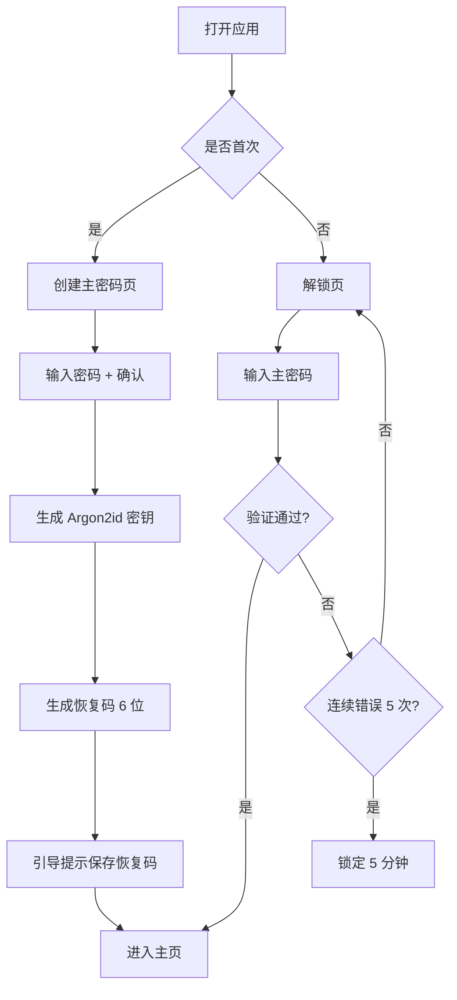
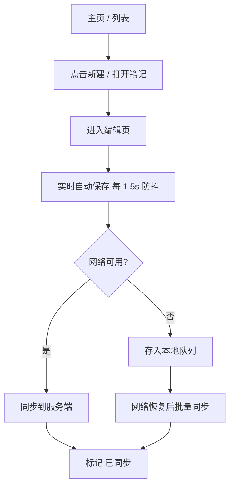
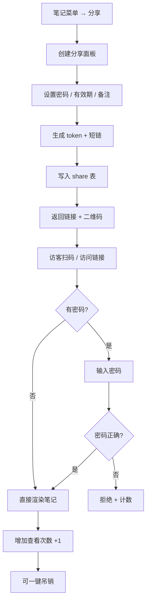
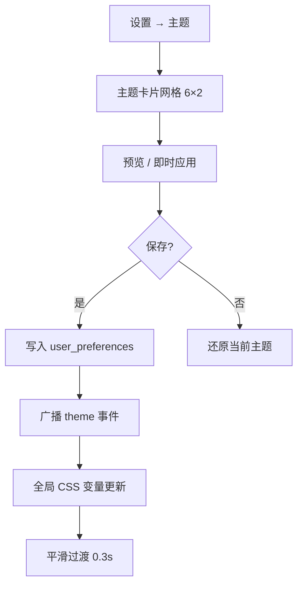

# DustNote 产品需求文档 (PRD)

> 文档版本：v1.0.0
> 适用产品：DustNote · 尘心笔记
> 目标读者：产品 / 设计 / 开发 / 测试

---

## 1. 产品概述

DustNote 是一款**单用户跨端个人笔记系统**。用户无需注册，仅凭主密码即可在 Web、桌面 PC、Android、小程序四端访问同一份笔记资产。系统以"小清新、平面化、强可控"为设计哲学，强调记录的轻便性、分享的可控性与视觉的呼吸感。

**目标用户**：追求效率与审美的个人写作者、学生、研究者、博主；他们需要一个零门槛、可长期沉淀、可选择性公开的私人笔记空间。

**核心价值**：

1. **零注册成本**——开箱即用，密码即身份
2. **真跨端同步**——一个主密码，Web / PC / 移动 / 小程序同源
3. **格式自由**——.txt / .md / .docx 自由导入；多格式可备份导出
4. **精细化分享**——单篇可分享、可设密码、可设过期、可一键吊销
5. **完善主题体系**——6 主题 × 2 模式 = 12 套皮肤，覆盖全天候使用场景

---

## 2. 核心功能

### 2.1 用户角色

由于产品定位为**单用户系统**，不存在传统多角色体系。仅在分享场景中出现"被分享者"这一临时角色。

| 角色            | 访问方式                  | 核心权限             |
| --------------- | ------------------------- | -------------------- |
| 主用户（Owner） | 主密码 + 可选设备生物识别 | 全部功能             |
| 访客（Visitor） | 分享链接 + 可选访问密码   | 仅可查看被分享的笔记 |

### 2.2 功能模块总览

产品由 6 大模块构成：

1. **身份与解锁模块**：主密码设置、修改、校验；设备本地生物识别快捷解锁；自动锁定
2. **笔记模块**：新建 / 编辑 / 删除 / 搜索 / 标签 / 收藏 / 回收站
3. **导入导出模块**：.txt / .md / .docx 导入；多格式导出备份
4. **分享模块**：生成可分享链接、可选访问密码、有效期、查看统计、吊销
5. **主题模块**：6 主题 × 亮/暗双模式、跟随系统、字体偏好、密度偏好
6. **设置模块**：账户、同步、设备管理、数据清理、关于

### 2.3 页面清单与功能描述

| 页面             | 模块     | 功能描述                                                                                                           |
| ---------------- | -------- | ------------------------------------------------------------------------------------------------------------------ |
| 解锁页           | 身份模块 | 大留白居中布局，单一密码输入框 + 解锁按钮；首次进入引导设置主密码；连续 5 次错误锁定 5 分钟                        |
| 主密码设置       | 身份模块 | 8 字符以上；需两次输入确认；强度提示条；用于生成加密密钥（Argon2id）                                               |
| 主页（笔记列表） | 笔记模块 | 左侧分类树（全部 / 标签 / 收藏 / 回收站），右侧卡片列表或双栏（PC 端）；支持按时间 / 标题 / 字数排序；顶部全局搜索 |
| 笔记编辑页       | 笔记模块 | Markdown 编辑器（左编辑右预览 / 移动端上下分栏）；工具栏：标题、加粗、斜体、链接、列表、引用、代码块、图片、附件   |
| 标签管理         | 笔记模块 | 浮动抽屉式；颜色标签；批量打标；未使用标签清理                                                                     |
| 回收站           | 笔记模块 | 显示 30 天内删除项；支持恢复 / 永久删除；可一键清空                                                                |
| 导入页           | 导入导出 | 拖拽 / 选择文件；预览解析结果；冲突策略选择（合并 / 覆盖 / 跳过）；批量确认导入                                    |
| 导出页           | 导入导出 | 时间范围 / 标签筛选；格式选择（Markdown / HTML / PDF / JSON）；可选附件包含；可下载 ZIP                            |
| 分享管理         | 分享模块 | 已分享列表：标题、链接、密码状态、过期时间、查看次数；可吊销 / 复制链接 / 调整过期                                 |
| 创建分享         | 分享模块 | 选择笔记 → 设置密码（可选）→ 设置有效期（1 天 / 7 天 / 30 天 / 永久）→ 备注 → 生成                                 |
| 访客分享页       | 分享模块 | 公共路由 `/share/:token`；如设密码先输入；只读渲染（Markdown）；底部"访问 DustNote"引导                            |
| 主题设置         | 主题模块 | 主题色卡片网格 6 × 2 = 12；亮/暗独立选择；字体（系统 / 思源 / 霞鹜）；行高密度（舒适 / 标准 / 紧凑）               |
| 全局设置         | 设置模块 | 主密码修改、自动锁屏时间、同步频率、清空缓存、导出全量数据、版本与开源协议                                         |
| 设备管理         | 设置模块 | 列出已登录设备；显示设备名、最后活跃、IP 摘要；支持踢出                                                            |

---

## 3. 核心流程

### 3.1 首次进入



### 3.2 笔记编辑与保存



### 3.3 分享流程



### 3.4 主题切换



---

## 4. 用户界面设计

### 4.1 设计风格

**关键词**：小清新、平面、留白、呼吸感、柔和阴影

- **主色（薄荷晨光）**：`#A8E6CF` 薄荷绿 + `#DCEDC8` 嫩芽黄绿
- **辅助色**：雾蓝 `#B5D8E8`、樱粉 `#FFD3DC`、暖橙 `#FFD9A6`、雾灰 `#E8ECEF`
- **强调色**：薄荷深绿 `#4FB783`（主操作）、蜜瓜橙 `#F5A65B`（警告）
- **圆角**：卡片 12px、按钮 8px、输入框 8px、头像 50%
- **阴影**：双层阴影——`0 1px 2px rgba(0,0,0,0.04)` + `0 8px 24px rgba(0,0,0,0.04)`
- **字体**：标题 `Manrope`（700/600），正文 `Noto Sans SC`（400/500），代码 `JetBrains Mono`
- **图标**：线性图标 1.5px 描边，圆角端点，24px 网格
- **动效**：所有交互 ease-out 200ms，主题切换 300ms 渐变，进入页面 stagger 60ms

### 4.2 各页面 UI 元素概览

| 页面           | 模块     | UI 元素                                                                                 |
| -------------- | -------- | --------------------------------------------------------------------------------------- |
| 解锁页         | 密码框   | 居中单卡 + 顶部 Logo 雾化渐变背景 + 输入框 focus 时光晕 0 0 0 4px rgba(168,230,207,0.4) |
| 主页           | 笔记列表 | 卡片网格 3 列（PC）/ 1 列（移动），悬浮上浮 -2px + 阴影加深；标签为小圆角胶囊           |
| 编辑页         | 编辑器   | 顶部简洁工具栏，编辑区与预览区 1:1 比例，中间分割线 1px dashed                          |
| 主题设置       | 主题卡片 | 圆角 16px 大卡片，左上主色大色块，下方主题名与亮/暗切换                                 |
| 分享管理       | 列表     | 表格 + 卡片混合，移动端折叠为卡片；状态用色彩徽标（生效中绿色 / 已过期灰色）            |
| 分享页（访客） | 内容区   | 极简白底，居中 720px 容器，顶部薄荷绿横条，底部品牌区                                   |

### 4.3 响应式

- **Desktop-first**：Web 端与桌面端主推 ≥1280px
- **平板 (≥768px)**：双栏 → 上下分栏
- **手机 (<768px)**：单栏、底部 Tab 栏、抽屉式菜单
- **小程序**：单栏 + 自定义导航栏；适配 rpx 单位

### 4.4 可访问性

- 主题对比度均通过 WCAG AA（正文 ≥ 4.5:1）
- 所有交互元素 ≥ 44×44px 触摸热区
- 键盘 Tab 顺序合理，焦点环 2px 薄荷绿
- 支持屏幕阅读器（aria-label 完整覆盖）

---

## 5. 数据与内容

### 5.1 笔记内容结构

```json
{
  "id": "uuid",
  "title": "string",
  "content": "markdown-string",
  "tags": ["string"],
  "isPinned": false,
  "isFavorite": false,
  "createdAt": "iso8601",
  "updatedAt": "iso8601",
  "deletedAt": null
}
```

### 5.2 分享结构

```json
{
  "token": "nanoid-12",
  "noteId": "uuid",
  "passwordHash": "argon2 | null",
  "expiresAt": "iso8601 | null",
  "viewCount": 0,
  "createdAt": "iso8601",
  "revokedAt": null
}
```

### 5.3 文件处理

- 导入：解析 → 生成笔记 → 进入待确认列表 → 批量入库
- 导出：根据格式模板渲染 → 打包 ZIP
- 附件：上传到服务端 `attachments/` 目录，笔记内引用相对路径

---

## 6. 性能与质量

- 首屏 LCP < 1.5s（Web / 桌面）
- 编辑器打字 60fps，无明显卡顿
- 列表 1k 条笔记滚动 60fps
- 离线可用：本地 SQLite（移动端）/ IndexedDB（Web 端）

---

## 7. 版本与发布

- v1.0.0：Web 端 + 主密码 + 笔记 CRUD + 主题
- v1.1.0：导入导出 + 分享
- v1.2.0：桌面端 Tauri
- v1.3.0：Android React Native
- v1.4.0：小程序 Taro
- v1.5.0：端到端加密同步、协同（可选）

---

## 8. 风险与限制

- 移动端与桌面端优先级低于 Web 端 v1.0，避免一次性铺开
- 协同编辑不在 v1.x 范围
- 端到端加密同步在 v1.5 评估
- 小程序审核与内容安全合规需单独评估（避免外链导出 PDF 大文件）
