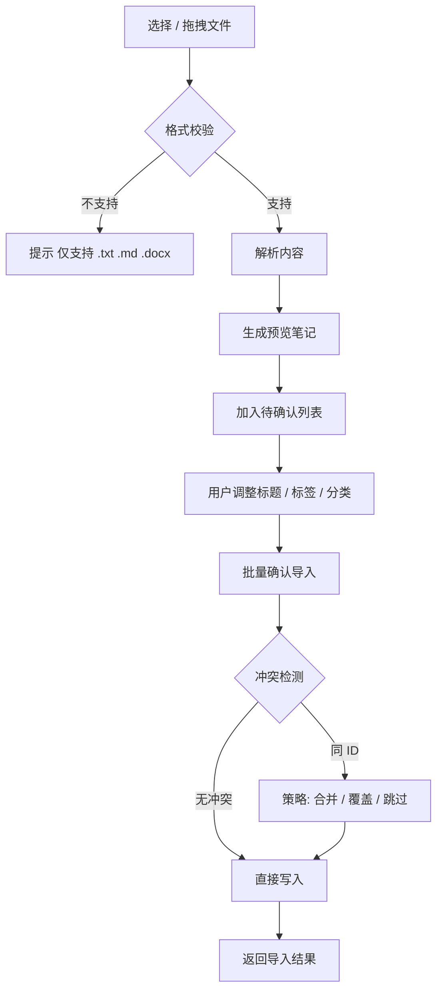
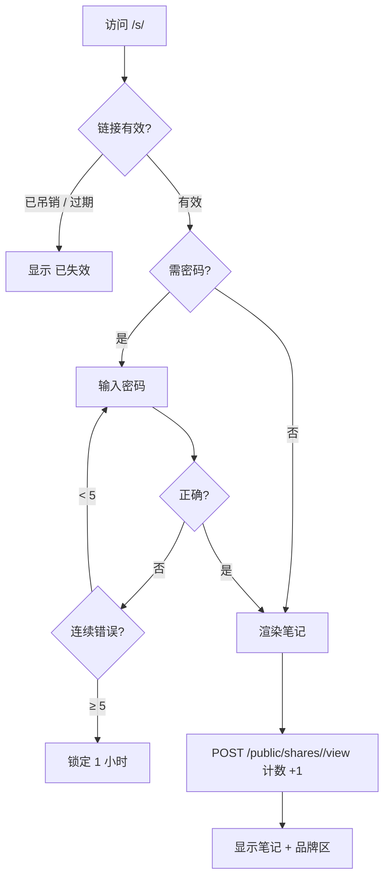
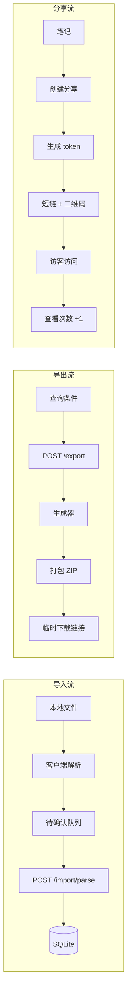
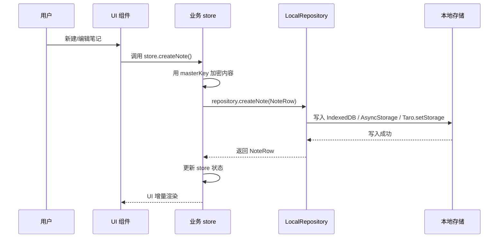
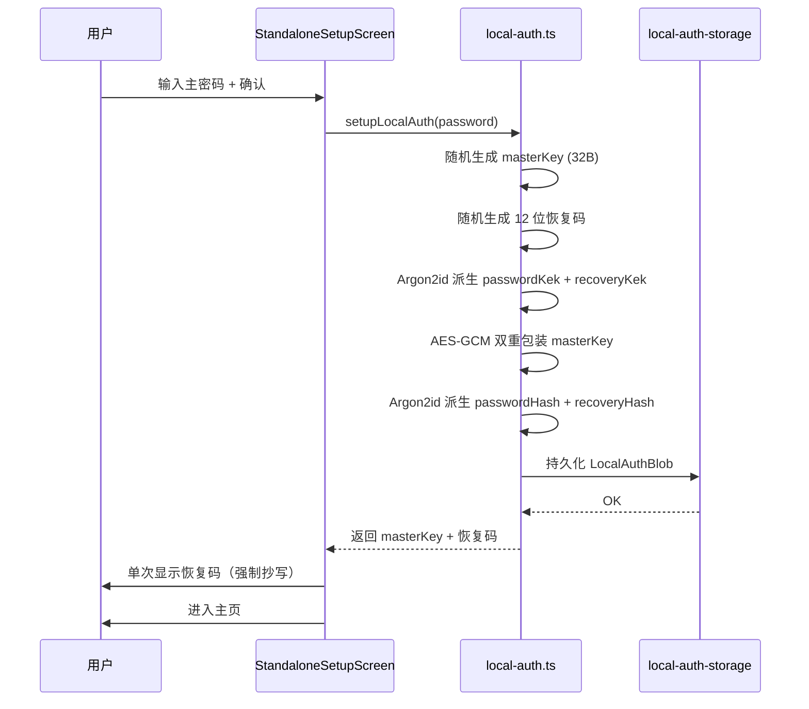
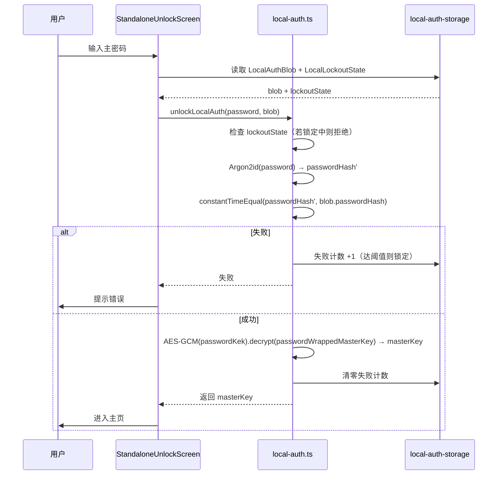
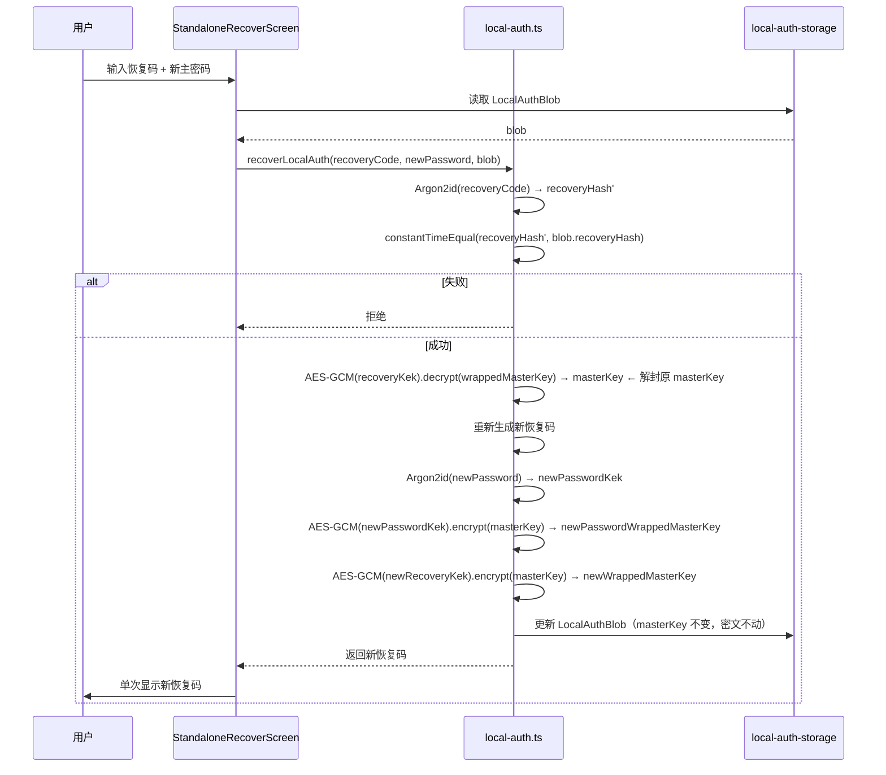
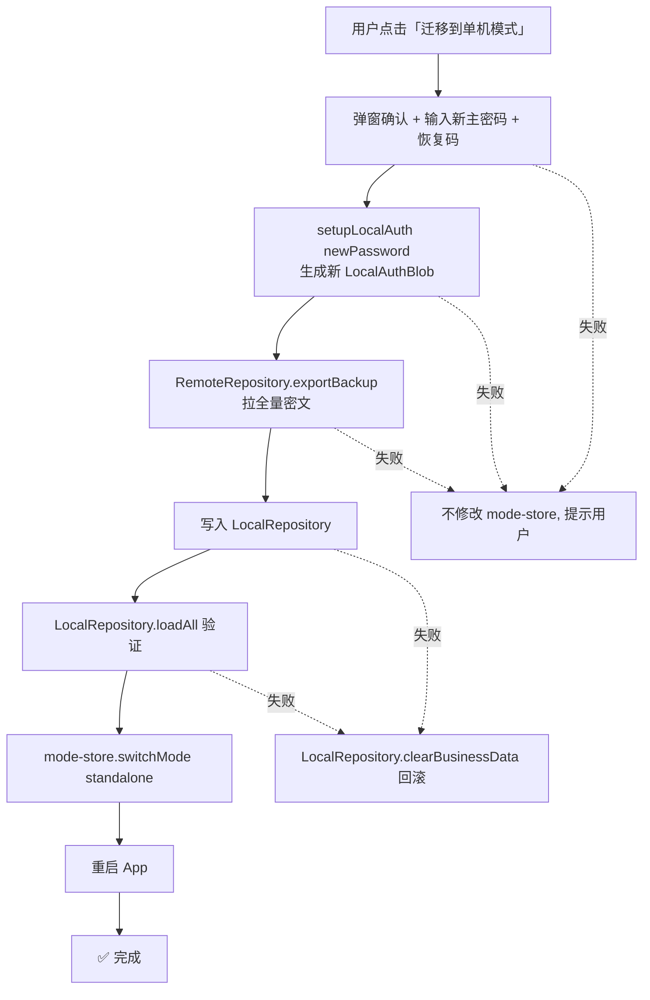

# DustNote 导入导出与分享规范

> 文档版本：v2.0.0
> 适用产品：DustNote · 尘心笔记
> 目标读者：产品 / 开发
> 关联文档：[standalone-mode.md](./standalone-mode.md)、[tech-architecture.md](./tech-architecture.md)

---

## 1. 导入规范

### 1.1 支持格式

| 格式      | 扩展名              | 解析方式                | 标题来源           | 备注           |
| --------- | ------------------- | ----------------------- | ------------------ | -------------- |
| 纯文本    | `.txt`              | 原样                    | 文件名             | 自动按段落切分 |
| Markdown  | `.md` / `.markdown` | 原样                    | 第一个 `#` 标题    | 保留原始格式   |
| Word 文档 | `.docx`             | mammoth → HTML → remark | 第一个 H1 或文件名 | 图片转为附件   |

### 1.2 导入流程



### 1.3 冲突策略

| 策略 | 行为                                        | 适用场景 |
| ---- | ------------------------------------------- | -------- |
| 合并 | 保留服务端版本，追加新内容（按 `---` 分隔） | 增量导入 |
| 覆盖 | 用新版本替换服务端                          | 强制刷新 |
| 跳过 | 不导入冲突项                                | 保守导入 |

### 1.4 大文件处理

- 单文件 > 5MB：分块上传，客户端先压缩为 `.zip`
- 单次导入 > 50 个文件：分批异步处理，进度条展示

### 1.5 .docx 解析细节

```typescript
// 使用 mammoth 将 .docx 转为 HTML
import mammoth from 'mammoth';

const result = await mammoth.convertToHtml({ arrayBuffer });
// 再使用 rehype -> remark 转为 Markdown
// 图片提取为附件
```

---

## 2. 导出规范

### 2.1 支持格式

| 格式               | 适用场景       | 优点         | 限制           |
| ------------------ | -------------- | ------------ | -------------- |
| **Markdown** (.md) | 二次编辑、迁移 | 纯文本、可读 | 富格式有限     |
| **HTML**           | 网页分享、归档 | 还原度高     | 文件较大       |
| **PDF**            | 长期保存、打印 | 跨平台稳定   | 不可二次编辑   |
| **JSON**           | 全量备份       | 完整结构     | 仅本工具可恢复 |

### 2.2 导出范围

- **时间范围**：fromDate / toDate
- **标签筛选**：单标签 / 多标签 AND / OR
- **状态筛选**：全部 / 收藏 / 置顶 / 已删除
- **附件包含**：可选，勾选后附加 `attachments/` 目录

### 2.3 导出包结构（JSON 备份）

```
dustnote-backup-2026-06-27.zip
├── manifest.json           # 导出元信息
├── notes/
│   ├── <note-id>.json      # 单条笔记（标题、内容、标签、元数据）
│   └── ...
├── tags.json               # 标签表
├── preferences.json        # 偏好
└── attachments/
    ├── <note-id>/<file>
    └── ...
```

```json
// manifest.json
{
  "version": "1.0.0",
  "exportedAt": "2026-06-27T10:00:00Z",
  "noteCount": 256,
  "includeAttachments": true,
  "checksum": "sha256:..."
}
```

### 2.4 PDF 导出

- 客户端：Web 用 `@react-pdf/renderer`，移动端用原生 `Print` 桥接
- 样式：注入主题色 → 灰度版（保证打印效果）
- 页眉：标题 + 页码；页脚：`DustNote · 导出于 <日期>`

---

## 3. 分享规范

### 3.1 分享粒度

- 仅支持**单条笔记**分享（v1.x 不支持笔记本 / 文件夹）
- 未来 v2.0 评估"集合分享"（含多条笔记只读视图）

### 3.2 分享属性

| 字段           | 类型             | 必填 | 说明                     |
| -------------- | ---------------- | ---- | ------------------------ |
| `token`        | string           | 是   | nanoid 12 位             |
| `passwordHash` | string \| null   | 否   | Argon2id；为空表示无密码 |
| `expiresAt`    | ISO 8601 \| null | 否   | null 表示永不过期        |
| `note`         | string           | 否   | 主人的备注（仅自己可见） |
| `viewCount`    | number           | -    | 服务端计数               |
| `revokedAt`    | ISO 8601 \| null | -    | 吊销后置位               |

### 3.3 分享 URL 规范

- 短链：`https://dustnote.app/s/<token>`
- API：`https://api.dustnote.app/api/v1/public/shares/<token>`
- 二维码：分享弹层可一键生成，svg 内嵌

### 3.4 访客访问流程



### 3.5 分享页面设计

- 极简白底（不受主人主题影响）
- 顶部 4px 薄荷绿横条
- 内容容器最大宽 720px，居中
- 底部品牌区："用 DustNote 记录你的想法 →"（可隐藏）
- 代码块语法高亮、表格、图片均支持
- 移动端：单栏阅读优化

### 3.6 安全约束

- 分享密码不与主密码共享，独立存储哈希
- IP 限流：每 IP 10 次/分钟
- 错误密码计数：5 次锁 1 小时
- 不返回敏感元数据（创建者邮箱等）
- 访问日志仅保留 IP 哈希（SHA-256 + 盐），7 天滚动删除
- 主人可随时吊销，立即失效

### 3.7 查看统计

- 总查看次数
- 最近 7 天 / 30 天趋势
- 不展示访问者身份（隐私保护）

---

## 4. 数据流向图



---

## 5. 边界与异常

### 5.1 导入异常

| 场景       | 表现           | 处理                         |
| ---------- | -------------- | ---------------------------- |
| 格式不支持 | 拖入 `.pdf`    | 红色 Toast + 提示            |
| 文件损坏   | docx 无法解析  | 标记为"失败"行，可重试或跳过 |
| 网络中断   | 批量导入到一半 | 失败项可重新加入队列         |
| 文件超大   | > 10MB         | 提示压缩后重试               |

### 5.2 导出异常

| 场景         | 表现       | 处理                |
| ------------ | ---------- | ------------------- |
| 笔记为空     | 没有匹配项 | 禁用导出按钮 + 提示 |
| PDF 渲染失败 | 库异常     | 降级为 HTML 导出    |
| 临时链接过期 | 1 小时     | 重新生成            |

### 5.3 分享异常

| 场景         | 表现           | 处理                 |
| ------------ | -------------- | -------------------- |
| 链接被吊销   | 主人删除       | 访客看到"已失效"     |
| 链接过期     | 超过 expiresAt | 访客看到"链接已过期" |
| 笔记被删除   | 主人软删除     | 主人可在 30 天内恢复 |
| 笔记永久删除 | 主人彻底删除   | 自动吊销关联分享     |

---

## 6. 单机模式数据流（v2.0.0 新增）

> 详见 [standalone-mode.md](./standalone-mode.md) 与 [tech-architecture.md §1.4-1.6](./tech-architecture.md)。

### 6.1 单机模式整体数据流

```mermaid
flowchart LR
    UI[UI 组件] --> STORE[业务 store / state]
    STORE --> REPO[DataRepository<br/>(LocalRepository 实例)]
    REPO --> STORAGE{各端本地存储}

    STORAGE --> IDB[(Web / Desktop<br/>IndexedDB)]
    STORAGE --> ASYNC[(Mobile<br/>AsyncStorage)]
    STORAGE --> TARO[(Miniprogram<br/>Taro.setStorage)]

    AUTH[mode-store + auth-store] -.注入.-> REPO
    AUTH -.本地鉴权.-> LOCALBLOB[(LocalAuthBlob<br/>+ LocalLockoutState)]
```

### 6.2 单机模式 CRUD 数据流



**关键差异（vs 联机模式）**：

- **无网络请求**：所有操作直接写本地存储
- **无离线队列**：单机模式不需要排队，操作即落地
- **无 WebSocket 推送**：不监听远程变更
- **无冲突检测**：单设备单用户场景下不存在冲突

### 6.3 单机鉴权数据流

#### 6.3.1 setup（首次设置）



#### 6.3.2 unlock（日常解锁）



#### 6.3.3 recover（恢复码重置）



### 6.4 单机模式导出/导入数据流

```mermaid
flowchart LR
    subgraph Export[导出流]
        LREPO1[LocalRepository] --> ALL1[loadAll: notes/folders/tags/prefs]
        ALL1 --> SER[JSON 序列化]
        SER --> ENC[AES-256-GCM 加密<br/>backupKey = HKDF(masterKey)]
        ENC --> ZIP[打包 ZIP<br/>manifest.json + backup.enc]
        ZIP --> DL[用户下载]
    end

    subgraph Import[导入流]
        UP[用户上传 ZIP] --> PARSE[解析 manifest.json]
        PARSE --> DEC[AES-256-GCM 解密]
        DEC --> DESER[反序列化]
        DESER --> MERGE[按 id 去重合并]
        MERGE --> LREPO2[LocalRepository 各分区]
    end
```

---

## 7. 模式切换数据迁移流程（v2.0.0 新增）

### 7.1 standalone → online 迁移

```mermaid
flowchart TD
    START[用户点击「迁移到联机模式」] --> CONFIRM1[弹窗确认 + 输入服务器地址 + 主密码]
    CONFIRM1 --> STATUS[/auth/status 检查]
    STATUS --> CHECK1{服务器已 setup?}
    CHECK1 -- 是 --> ABORT1[提示用户先 /auth/unlock 或换空服务器]
    CHECK1 -- 否 --> SETUP[/auth/setup 完成联机鉴权]
    SETUP --> LOAD[LocalRepository.loadAll]
    LOAD --> UPLOAD[遍历调用 RemoteRepository.createXxx<br/>folders → tags → notes → preferences]
    UPLOAD --> VERIFY1[RemoteRepository.loadAll 验证]
    VERIFY1 --> CLEAR[LocalRepository.clearBusinessData<br/>保留 LocalAuthBlob]
    CLEAR --> SWITCH[mode-store.switchMode online]
    SWITCH --> RESTART[重启 App]
    RESTART --> DONE[✅ 完成]

    CONFIRM1 -.失败.-> ROLLBACK1[不修改 mode-store, 提示用户]
    SETUP -.失败.-> ROLLBACK1
    UPLOAD -.失败.-> ROLLBACK2[RemoteRepository.clearBusinessData 回滚]
    VERIFY1 -.失败.-> ROLLBACK2
```

### 7.2 online → standalone 迁移



### 7.3 失败回滚原则

1. **原子化**：迁移过程中任一步骤失败立即终止
2. **回滚目标 Repository**：已写入的目标调用 `clearBusinessData()` 清空
3. **不修改 mode-store**：用户仍处于原模式，可重试
4. **保留源 Repository 数据**：迁移成功后才清空源数据
5. **用户提示**：弹窗显示失败原因 + 重试按钮

### 7.4 数据一致性保证

| 阶段              | 一致性保证                                                            |
| ----------------- | --------------------------------------------------------------------- |
| 迁移中（写一半）  | 失败则回滚目标，源数据未动                                            |
| 迁移完成（已切换）| 双方 Repository 都有完整数据，等待用户确认后才清空源                  |
| 重启后            | mode-store 已切换，新 Repository 是数据源                             |

详细流程见 [standalone-mode.md §7](./standalone-mode.md)。
