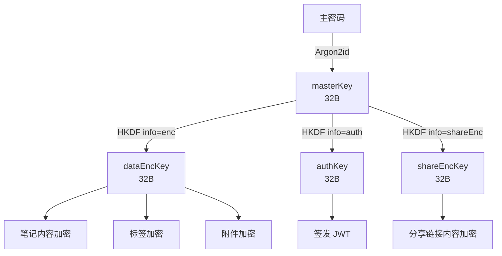
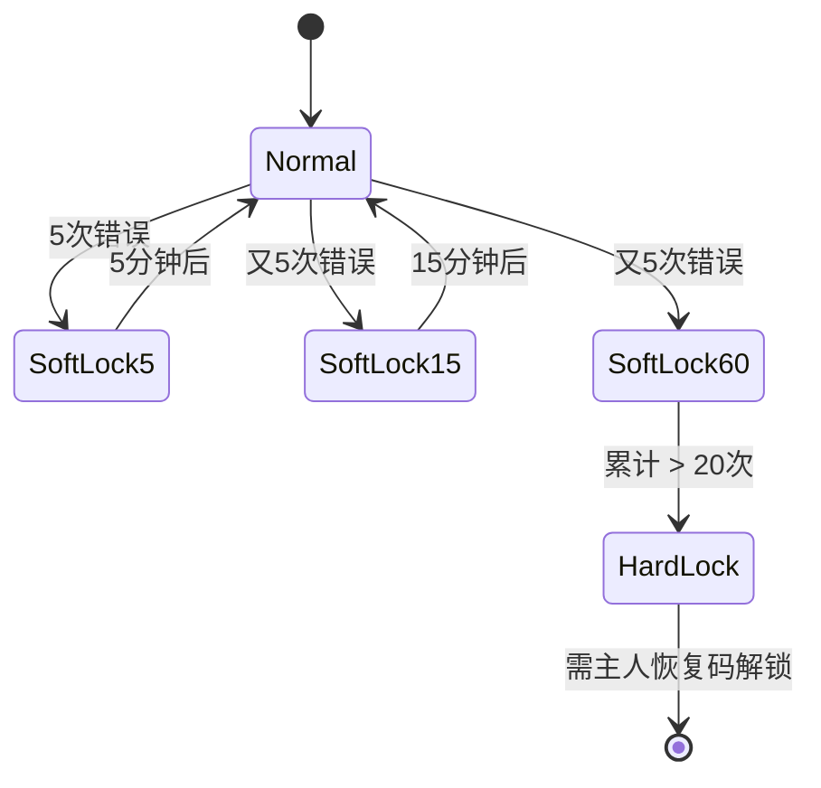

# DustNote 安全防护与防信息泄露规范

> 文档版本：v1.0.0
> 适用产品：DustNote · 尘心笔记
> 目标读者：架构师 / 后端 / 前端 / 移动端 / 安全工程师 / 运维

---

## 0. 设计哲学

DustNote 作为**单用户长期沉淀**的笔记系统，其威胁模型与多用户 SaaS 显著不同：

1. **核心威胁不是"别人进得来"，而是"如果进来了什么都看不到"**——即**纵深防御 + 端到端加密**为核心
2. **服务端不应被信任**——理想情况下服务端只看见密文，看不见明文
3. **设备物理接触**是高危场景——必须假设设备可能丢失、被借、被偷窥
4. **可恢复性优于绝对安全**——主密码遗忘不能等于"全盘丢失"，但恢复流程必须严苛

威胁分级：

| 等级 | 场景 | 防护目标 |
|------|------|----------|
| L1 | 路人/同事短暂接触设备 | 自动锁屏、生物识别保护 |
| L2 | 设备丢失/被盗 | 端到端加密 + 远程踢出 |
| L3 | 数据库被脱库 | 服务端仅存密文 |
| L4 | 服务端被完全控制 | 仍无法获取明文（E2EE） |
| L5 | 网络中间人 | 强制 HTTPS + 证书钉扎 |
| L6 | 客户端二进制被逆向 | 主密码永远不存盘 |

---

## 1. 身份与认证加固

### 1.1 主密码策略

| 项目 | 策略 | 理由 |
|------|------|------|
| 最小长度 | 10 字符 | 平衡安全性与体验 |
| 推荐长度 | 16+ 字符 | 强度提示到绿色 |
| 字符类型 | 不强制混合 | 现代安全建议：长度优先 |
| 黑名单 | top-1w 常见弱密码 | 服务端校验 |
| 哈希算法 | **Argon2id** | m=64MB, t=3, p=4 |
| 客户端派生 | Argon2id → HKDF-SHA256 → 32B masterKey | 用于 E2EE |
| 存储 | 服务端仅存 passwordHash；masterKey 不上服务端 | 零知识 |
| 校验 | constant-time 比较 | 防侧信道 |

### 1.2 恢复码

- 首次创建主密码时生成 **12 词 BIP-39 风格恢复码**
- 单次显示，强制用户勾选"已抄写"
- 服务端仅存恢复码哈希（Argon2id）
- 一次性使用，使用后立即失效
- 重新生成会吊销旧的

### 1.3 双因素认证（v1.2+ 评估）

- 可选 TOTP（RFC 6238）
- 主密码 + TOTP 同时通过才能登录
- TOTP 密钥在服务端加密存储（AES-256-GCM，主密码派生 key 加密）
- 备份码：8 组一次性短码

### 1.4 JWT 策略

```
Access Token:
  - 算法: HS256（或 RS256 多实例）
  - 有效期: 15 分钟
  - 包含: { sub: userId, iat, exp, jti }
  - 存储: 内存（Web 端）/ Keychain（移动端）

Refresh Token:
  - 算法: HS256
  - 有效期: 7 天（可滑动续期）
  - 包含: { sub: userId, jti, familyId }
  - 存储: httpOnly + Secure + SameSite=Strict Cookie
  - 服务端维护 jti 黑名单 + 家族检测（replay 防御）
```

### 1.5 会话与自动锁

| 触发 | 动作 |
|------|------|
| 输入错误 5 次 | 软锁 5 分钟（递增：5/15/60/240/1440 min） |
| 空闲 N 分钟 | 自动锁屏（默认 15） |
| 切到后台（移动） | 立即锁屏 |
| 关闭窗口（Web） | 清空内存中的解密密钥 |
| 复制主密码 | 立即清空剪贴板 |
| 截图（移动） | 屏蔽笔记内容（FLAG_SECURE 等价） |

---

## 2. 端到端加密（E2EE）

### 2.1 密钥层级



### 2.2 笔记加密

| 项目 | 方案 |
|------|------|
| 算法 | AES-256-GCM |
| 模式 | 每个笔记独立 12B nonce（随机） |
| AAD | `noteId \|\| userId` 防重排 |
| 存储 | 密文 + 12B nonce + 16B tag = base64 |
| 标题 | 同算法独立加密（便于独立查询？v1 暂不支持密文搜索） |
| 标签 | 加密存储，标签管理以本地索引为主 |
| 搜索 | 客户端维护明文索引（仅本地）；服务端仅做密文同步 |
| 密钥轮换 | 修改主密码时 re-encrypt 所有 DEK 派生的密文 |

### 2.3 附件加密

- 大附件（>1MB）使用 **AES-256-GCM streaming**（即每 1MB chunk 单独加密 + nonce 递增）
- 上传前客户端加密，文件名也加密（HMAC-SHA256(filename) 做去重键）
- 服务端只看到 `attachment/<uuid>.enc`，看不到原文件名 / 内容

### 2.4 密钥轮换

| 触发 | 行为 |
|------|------|
| 用户改主密码 | 重新派生 MK；用旧 DEK 解密 → 新 DEK 加密（一次性后台任务） |
| 设备被踢出 | 仅踢出该设备会话；不轮换 MK（用户私事） |
| 检测泄露 | 全用户轮换（极端场景） |

### 2.5 服务端"看得见"的内容

| 内容 | 服务端是否可见 | 说明 |
|------|----------------|------|
| 用户 ID / 主密码哈希 | 是 | 用于登录 |
| 笔记密文 | 是 | 但无法解密 |
| 笔记标题（明文） | **否** | E2EE |
| 笔记内容（明文） | **否** | E2EE |
| 标签 | **否** | E2EE |
| 附件密文 | 是 | 但无法解密 |
| 附件原始文件名 | **否** | E2EE |
| 分享 token / 分享密文 | 是 | 但无法解密 |
| 分享密码哈希 | 是 | 用于访客校验 |
| 主题 / 偏好 | 是 | 非敏感元数据 |
| 创建/更新时间 | 是 | 同步必需 |
| 设备列表 / 设备指纹 | 是 | 会话管理 |
| IP（仅哈希） | 是 | 反滥用 |

---

## 3. 防信息泄露（Defense Against Information Disclosure）

### 3.1 服务端日志净化

**红线：日志中绝不出现明文笔记内容、附件原始名、分享密码明文。**

```typescript
// server/src/middleware/logger.ts
const SENSITIVE_KEYS = new Set([
  'password', 'content', 'title', 'token', 'note', 'attachment_filename'
]);

function sanitize(obj: any): any {
  if (typeof obj !== 'object' || obj === null) return obj;
  if (Array.isArray(obj)) return obj.map(sanitize);
  return Object.fromEntries(
    Object.entries(obj).map(([k, v]) => [
      k,
      SENSITIVE_KEYS.has(k.toLowerCase()) ? '[REDACTED]' : sanitize(v)
    ])
  );
}

pinoLogger.info({ body: sanitize(req.body) }, 'request');
```

**PII 处理**：
- IP 地址入库前 SHA-256 加盐哈希，盐值 24h 轮换
- 邮箱 / 手机号：v1 不收集
- 设备指纹：仅保留 SHA-256(UA + screen) 的前 12 字符

### 3.2 错误响应规范

| 错误类型 | 对外暴露 | 日志完整记录 |
|----------|----------|--------------|
| 4xx 业务错误 | 简洁文案 + code | 完整堆栈 |
| 5xx 系统错误 | "服务异常，请稍后重试" + 追踪 ID | 完整堆栈 + 上下文 |
| 认证失败 | "密码错误" / "令牌失效" | 详细原因 |
| 验证失败 | 字段级提示（不暴露 schema） | 完整请求体（已脱敏） |
| 数据库错误 | 永远不暴露原始错误 | 完整堆栈 + SQL（仅内部） |

```typescript
// 统一错误格式（对外）
interface ErrorResponse {
  code: string;        // 'AUTH_INVALID_PASSWORD'
  message: string;     // 人类可读
  traceId: string;     // 用于日志关联
  details?: object;    // 字段级错误
}
```

### 3.3 内存与进程防护

| 场景 | 防护 |
|------|------|
| 主密码输入 | 输完即用，用后清栈变量；不在 heap 持久化 |
| 解密密钥 | 仅放在闭包 / Web Worker，不写入全局 |
| 进程退出 | Node.js `process.on('exit')` 清零敏感 Buffer |
| 浏览器关闭 | `beforeunload` 触发 masterKey 内存清零 |
| GC 压力 | 关键密钥 Buffer 标记为不可优化（`process.binding` 或 `-zero`） |
| 共享主机 | 服务端容器关闭 core dump（`ulimit -c 0`） |

### 3.4 客户端本地存储加密

| 端 | 存储 | 加密方式 |
|----|------|----------|
| Web | IndexedDB (Dexie) | 用 masterKey 派生 localDEK 加密 |
| Web | localStorage | **禁用** 存敏感字段 |
| Web | sessionStorage | 仅存非敏感 UI 状态 |
| Desktop (Tauri) | 本地 SQLite | SQLCipher |
| Mobile (RN) | SQLite | SQLCipher |
| Mobile (RN) | Keychain | iOS Keychain / Android EncryptedSharedPreferences |
| 小程序 | Taro.storage | 加密 + 受限空间（10MB） |

**Web 端 IndexedDB 加密示例**：
```typescript
import { gcm } from '@noble/ciphers/aes';
import { utf8ToBytes, bytesToUtf8 } from '@noble/hashes/utils';

async function encryptForLocal(plain: string, key: Uint8Array) {
  const nonce = crypto.getRandomValues(new Uint8Array(12));
  const cipher = gcm(key, nonce);
  const ct = cipher.encrypt(utf8ToBytes(plain));
  return { nonce, ct };
}
```

### 3.5 剪贴板防护

| 端 | 行为 |
|----|------|
| Web | 复制主密码后 15s 自动清空；复制明文笔记可关闭自动清空 |
| Desktop | 复制后 60s 自动清空；可选"KeePass 风格 Ctrl+V 即清空" |
| Mobile | 复制带水印（"来自 DustNote · 2026-06-27 14:30"）防溯源 |
| 全部 | 永远不自动复制主密码 |

### 3.6 截图与录屏防护

| 端 | 方案 |
|----|------|
| Desktop (Tauri) | 设置 `setWindowProtected(true)` 防截屏（macOS）/ DRM（Windows） |
| Mobile (Android) | `WindowManager.LayoutParams.FLAG_SECURE` |
| Mobile (iOS) | UITextField 防截屏（UIPreventScreenCapture） |
| Web | 监听 `visibilitychange` 切换时显示遮挡层 |
| 访客分享页 | 禁止 Ctrl+S（保存）、禁止右键菜单（可选） |

### 3.7 浏览器侧信道防护

- **历史记录防泄漏**：解锁页设置 `<meta name="referrer" content="no-referrer">` + Cache-Control: no-store
- **Back/Forward Cache 排除**：解锁页 + 编辑页加 `Cache-Control: no-store, private`
- **Service Worker**：不缓存笔记内容；仅缓存静态资源
- **CSP 严格策略**：

```
Content-Security-Policy:
  default-src 'self';
  script-src 'self' 'wasm-unsafe-eval';
  style-src 'self' 'unsafe-inline';
  img-src 'self' data: https:;
  font-src 'self' data:;
  connect-src 'self' https://api.dustnote.app;
  frame-ancestors 'none';
  base-uri 'self';
  form-action 'self';
  object-src 'none';
  upgrade-insecure-requests;
```

### 3.8 反爬与反枚举

- 登录接口固定返回时间（±50ms 抖动），防时序攻击判断用户存在
- 分享 token 用 `nanoid(12)`，避免顺序 ID 枚举
- 公开分享页 IP 限流：10 req/min
- 错误密码次数计入"指纹"（IP+UA hash），跨账户累计
- Honeypot 字段：登录表单加隐藏 `website` 字段，机器人会填

### 3.9 数据库与文件权限

```bash
# SQLite 文件
chmod 600 /data/dustnote.db
chown dustnote:dustnote /data/dustnote.db

# 附件目录
chmod 700 /data/attachments
chown -R dustnote:dustnote /data/attachments

# 容器以非 root 运行
USER dustnote

# 只读根文件系统
docker run --read-only --tmpfs /tmp
```

### 3.10 第三方依赖最小化

- 不引入 Google Analytics / Sentry / 任何第三方 JS
- 字体自托管（不连 Google Fonts）
- 静态资源全部自有 CDN
- 定期 `pnpm audit` + Dependabot
- 关键依赖锁版本（pnpm-lock + integrity）

---

## 4. 反暴力与限流

### 4.1 限流策略

| 接口 | 维度 | 阈值 | 触发后行为 |
|------|------|------|------------|
| `POST /auth/login` | IP | 5/min | 429 + 退避 |
| `POST /auth/login` | 指纹 | 5/15min | 软锁 |
| `POST /shares/<token>/unlock` | IP | 10/min | 429 |
| 全 API | IP | 600/min | 429 |
| 写操作 | 用户 | 60/min | 429 |
| 导出 | 用户 | 5/hour | 429 |

### 4.2 软锁与硬锁



### 4.3 异常行为告警

- 同一 token 5 分钟内被 > 50 个不同 IP 访问 → 标记可疑 + 通知主人
- 跨地理大跳跃登录（基于 IP 哈希粗略地区） → 强制二次确认
- 异常导出大流量 → 临时限制 + 通知
- 分享 token 进入已知代理/VPN 出口 → 标记

---

## 5. 网络与传输

### 5.1 HTTPS 强制

- HTTP → HTTPS 301 重定向
- HSTS：`Strict-Transport-Security: max-age=31536000; includeSubDomains; preload`
- 申请 HSTS Preload List
- TLS 1.3 only，禁用 TLS 1.0/1.1/1.2（合规要求）
- 强加密套件：`TLS_AES_256_GCM_SHA384` 优先
- OCSP Stapling 启用
- CAA 记录限制证书签发

### 5.2 反 SSRF / SSRF 防护

- 分享附件预览不代理外部 URL
- 头像 / 图片上传仅接受本地或自家对象存储
- 用户输入的 URL 永远不直接服务端 fetch

### 5.3 证书钉扎（移动端）

- 移动 App 内置 SPKI 哈希，启动时校验
- 备用哈希（备份密钥轮换）
- 仅用于 API 域名，不影响用户访问其他网站

### 5.4 WebSocket 安全

- `/api/v1/sync` WebSocket 强制 WSS
- 每条消息带时间戳 + nonce，防重放
- 服务端维护 seen-nonce LRU 缓存（5 分钟）
- 断线重连：指数退避 + token refresh

---

## 6. 应用层攻击防护

### 6.1 SQL 注入

- 全部使用 better-sqlite3 参数化查询
- 禁止字符串拼接 SQL
- 关键字白名单排序字段
- 慢查询日志

### 6.2 XSS

- React 默认转义 + 严格 CSP
- Markdown 渲染走 `rehype-sanitize` 白名单
- 用户内容绝不通过 `dangerouslySetInnerHTML`（除非已 sanitize）
- 富文本粘贴自动剥离 `<script>` / `on*` 属性
- 上传文件名清洗：`../`、`%00` 全部拒绝

### 6.3 CSRF

- 写操作要求自定义 Header `X-DustNote-Request: 1`
- Cookie `SameSite=Strict`
- 关键操作（改密码、踢出设备）要求输入主密码再次确认

### 6.4 SSRF / Open Redirect

- 分享 URL 不重定向到任意域
- 登录后跳转来源校验白名单

### 6.5 文件上传安全

| 项目 | 策略 |
|------|------|
| 类型校验 | Magic bytes（不靠扩展名） |
| 大小限制 | 单文件 50MB（v1） |
| 病毒扫描 | ClamAV 异步扫描（v1.1+） |
| 重命名 | 全部用 UUID，无原始文件名 |
| 存储 | `/data/attachments/<uuid>.enc`，独立卷 |
| 直链 | 全部走鉴权代理，签名 URL 短期有效 |

---

## 7. 隐私保护

### 7.1 隐私原则

1. **数据最小化**：只收集必要数据
2. **目的限制**：不用于声明外的用途
3. **存储限制**：到期删除（IP 哈希 7 天，访问日志 30 天）
4. **透明**：用户可导出 / 删除全部数据

### 7.2 用户权利（GDPR 友好）

- **导出权**：`POST /api/v1/me/export` → 全量加密 ZIP
- **删除权**：`DELETE /api/v1/me` → 30 天后物理删除（软删除缓冲）
- **知情权**：隐私政策 / 数据清单在设置页可见

### 7.3 遥测

- 默认**完全关闭**遥测
- 启动时明确弹窗"我们不发送任何使用数据"
- 可选的崩溃报告：本地生成 .dmp，用户**手动**决定是否发送
- 错误上报：可选 checkbox，默认关

---

## 8. 备份与灾备

### 8.1 备份加密

```typescript
async function exportBackup(userId: string, password: string) {
  const salt = randomBytes(16);
  const key = await argon2id(password, salt, { m: 64, t: 3, p: 4 });
  const enc = gcm(key, randomBytes(12));
  
  const backup = {
    manifest: { version, exportedAt },
    notes: await getAllNotes(userId),
    preferences,
    tags
  };
  
  const ct = enc.encrypt(utf8ToBytes(JSON.stringify(backup)));
  return packZip({
    'manifest.json': { salt, nonce, kdf: { alg: 'argon2id', m: 64, t: 3, p: 4 } },
    'backup.enc': ct
  });
}
```

### 8.2 备份策略

| 维度 | 策略 |
|------|------|
| 频率 | 每日 03:00 |
| 保留 | 7 / 30 / 365 天三档 |
| 存储 | 异地加密对象存储 |
| 测试 | 每月一次恢复演练 |
| 加密 | 备份专用密码（不同于主密码），双盲 |

### 8.3 灾难恢复

- RPO ≤ 24h（每日备份）
- RTO ≤ 4h
- 备份密钥托管：支持用户上传 GPG 公钥加密备份
- 详细 Runbook 见内部文档

---

## 9. 审计与监控

### 9.1 安全事件日志

| 事件 | 字段 | 保留 |
|------|------|------|
| 登录成功 | userId、UA、IP-hash、ts | 90 天 |
| 登录失败 | IP-hash、UA、reason、ts | 90 天 |
| 改密码 | userId、ts | 永久 |
| 创建 / 吊销分享 | userId、shareId、ts | 永久 |
| 导出数据 | userId、format、size、ts | 永久 |
| 踢出设备 | userId、deviceId、ts | 永久 |
| 软锁 / 硬锁 | IP-hash、ts、duration | 90 天 |

### 9.2 监控指标

- 登录失败率（5xx 比例）
- 单 IP 异常请求数
- 端到端同步冲突率
- API P95 / P99
- 服务端解密尝试失败数（理论上应为 0）

### 9.3 告警

- 5 分钟内 > 50 次登录失败 → 邮件 + Webhook
- 单用户导出 > 100MB → 通知主人确认
- 数据库进程 CPU 异常 → 运维告警

---

## 10. 供应链安全

| 措施 | 实现 |
|------|------|
| 依赖锁定 | `pnpm-lock.yaml` 提交，CI 校验 |
| 漏洞扫描 | GitHub Dependabot + `pnpm audit` |
| SBOM | CI 自动生成 CycloneDX SBOM |
| 签名 | 桌面 / 移动端发布 GPG + 公证（macOS / Windows） |
| 第三方 JS | 不允许；CSP 强制 |
| 子资源完整性 | 第三方 CSS 不用；自托管字体加 SRI |
| 镜像源 | 国内 + GitHub 双源，防劫持 |

---

## 11. 物理 / 设备安全

| 场景 | 防护 |
|------|------|
| 设备丢失 | 主人可登录 web 端踢出该设备（强认证后） |
| 设备被盗 + 已解锁 | E2EE 内容仍需主密码；自动锁屏兜底 |
| 二手出售 | 设置 → 清空本地缓存（含 SQLite / IndexedDB） |
| 维修 | 启用"维修模式"：仅显示锁屏界面 |
| 越狱 / Root | 移动端检测后警告但不强制退出（避免误伤） |

---

## 12. 安全开发生命周期（SDL）

| 阶段 | 行动 |
|------|------|
| 设计 | 威胁建模（STRIDE）入 PR 模板 |
| 编码 | ESLint 安全规则 + 关键函数必须 review |
| Code Review | 安全敏感代码需 2 人 review |
| 测试 | OWASP ZAP 扫描 + 渗透测试（每季度） |
| 发布 | 强制 security audit + SBOM + 签名 |
| 运营 | 漏洞响应 SLA：P0=4h, P1=24h, P2=7d |
| 披露 | 公开 `SECURITY.md` + 漏洞悬赏（v2.0 评估） |

---

## 13. 应急响应预案

### 13.1 漏洞披露

- 邮箱：`security@dustnote.app`
- PGP 公钥：项目根目录
- 响应时间：24h 内确认
- 修复时间：P0 紧急热修，P1 一周内，P2 随版本

### 13.2 数据泄露应对

1. **检测**：监控告警 + 用户反馈
2. **评估**：范围（哪些字段、明文/密文）
3. **止损**：强制所有会话失效 + 轮换 JWT 密钥
4. **通知**：受影响用户（即使只有自己也要透明）
5. **复盘**：公开 postmortem（30 天后）

### 13.3 主密码泄露应对

- 立即改主密码 + 触发 re-encrypt
- 强制所有设备重新认证
- 检查异常访问日志
- 必要时清除服务端密文（极端自毁模式）

---

## 14. 法规与合规

| 法规 / 标准 | 适用度 | 措施 |
|-------------|--------|------|
| GDPR | 自愿（单用户） | 数据最小化、导出、删除 |
| CCPA | 自愿 | 同上 |
| 中国《个人信息保护法》 | 自愿 | 隐私政策 + 同意 + 跨境评估 |
| 等保 2.0 | 非强制 | 设计上对齐三级要求 |
| SOC 2 | 商业化时考虑 | 日志、访问控制、变更管理 |
| WCAG 2.1 AA | 设计目标 | 见 UI 规范 |

---

## 15. 安全检查清单（每次发版必跑）

- [ ] `pnpm audit --prod` 0 high / critical
- [ ] 容器以非 root 运行
- [ ] CSP 头校验通过
- [ ] HSTS 头存在且 preload
- [ ] TLS 1.3 only
- [ ] SQL 全部参数化（grep 验证无字符串拼接）
- [ ] 错误响应不泄漏内部细节
- [ ] 关键路径单元测试覆盖
- [ ] 渗透测试报告无 P0/P1
- [ ] SBOM 已生成
- [ ] 备份恢复演练通过
- [ ] 密钥轮换演练通过
- [ ] 漏洞响应联系人更新
- [ ] 隐私政策与代码功能一致

---

## 16. 仍接受的风险

| 风险 | 接受理由 | 缓解 |
|------|----------|------|
| 主密码弱 + 设备未锁 | 用户责任 | UI 引导、强度提示 |
| 客户端被 root 注入 | 移动端做不到绝对防护 | 服务端仅存密文 |
| 国家行为体攻击服务端 | 单用户系统威胁等级低 | E2EE 兜底 |
| 算法未来被攻破 | 当前无解 | 保留轮换能力 |
| 内部恶意员工 | 小团队风险有限 | 代码 review + 最小权限 |
