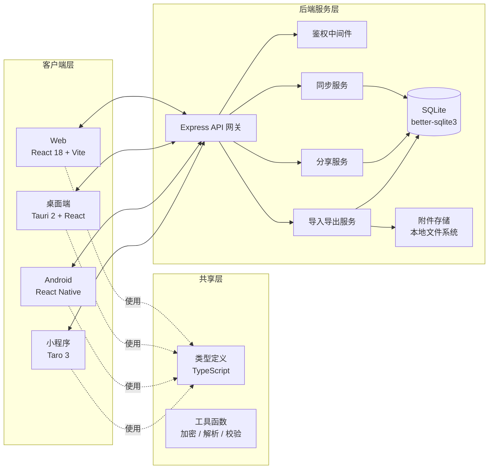
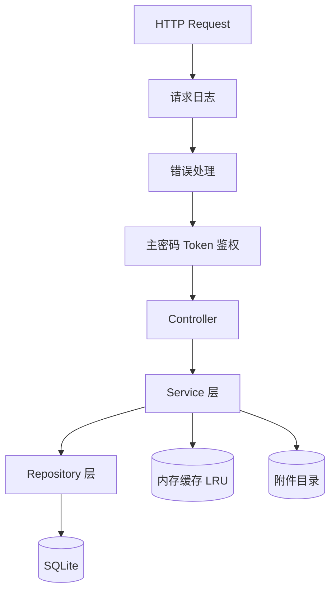
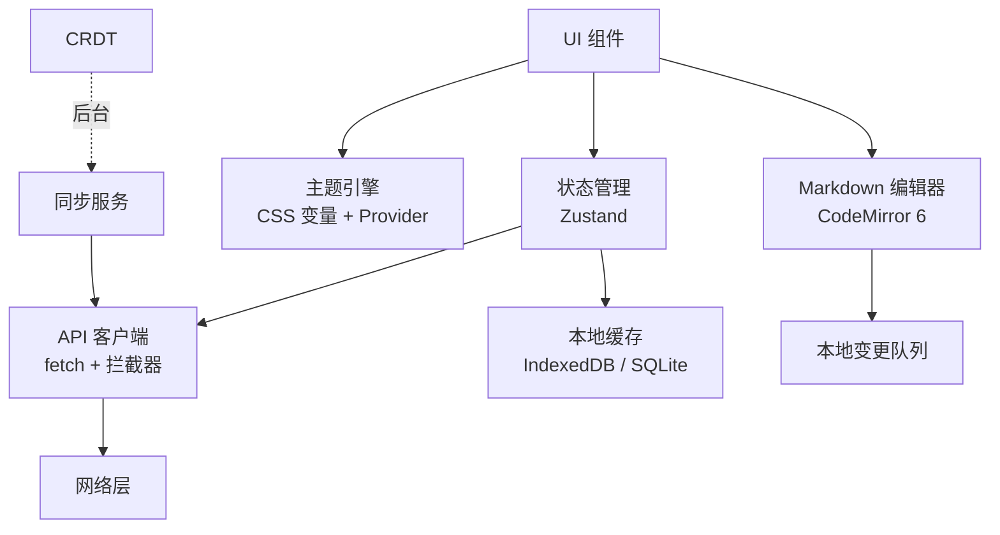
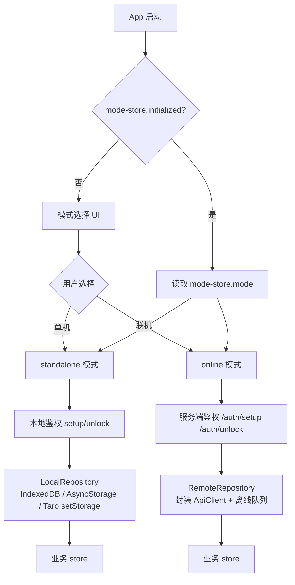
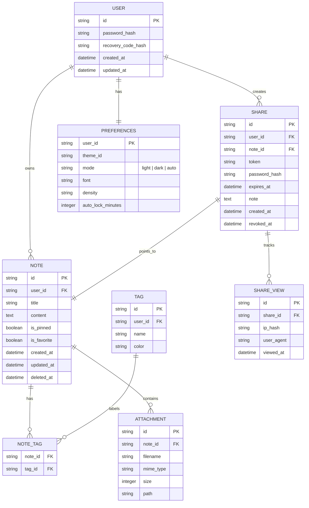
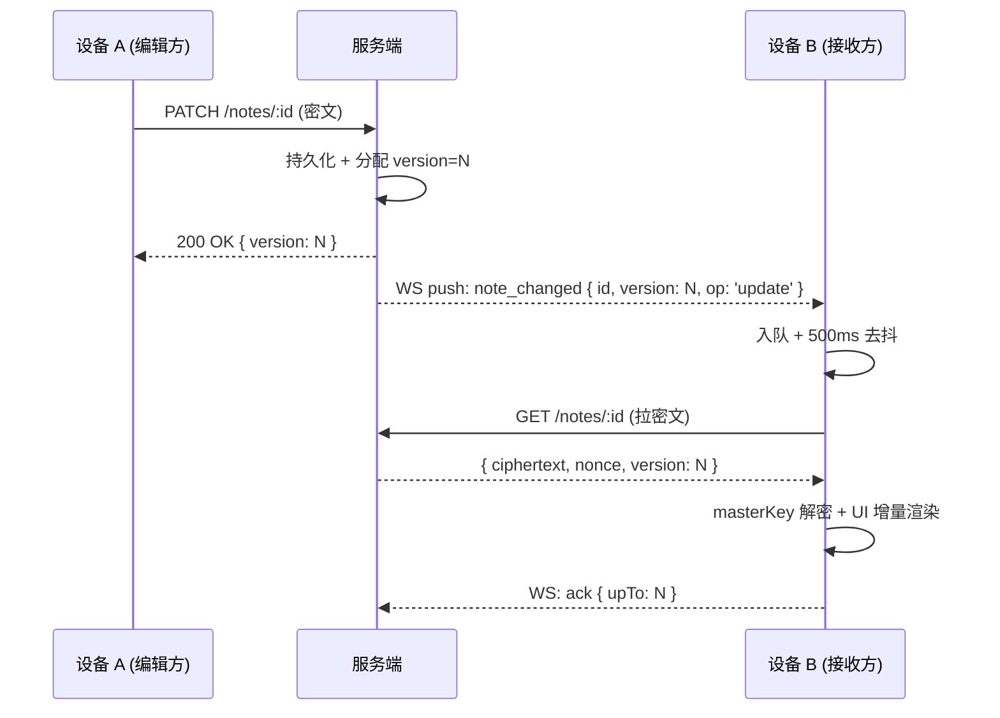
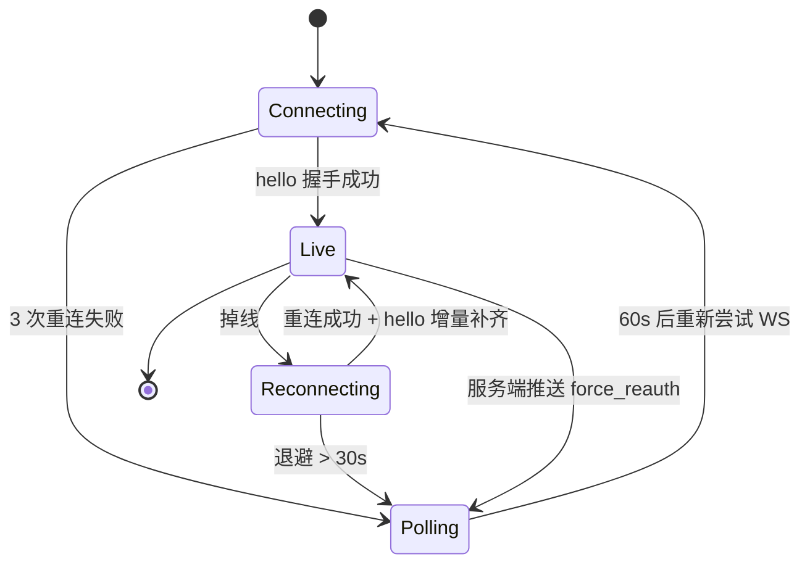

# DustNote 技术架构文档

> 文档版本：v2.0.0
> 适用产品：DustNote · 尘心笔记
> 目标读者：架构师 / 后端 / 前端 / 移动端 / 小程序 / DevOps

---

## 0. 技术栈锁定决策（已审阅通过，变更需评审）

> 本节为**已锁定决策**，后续变更必须经架构评审，避免反复摇摆。

| 维度           | 决策                                                   | 理由                                         |
| -------------- | ------------------------------------------------------ | -------------------------------------------- |
| **架构模式**   | 单仓多包 monorepo（pnpm workspace）                    | 跨端代码共享、类型统一、CI 一致              |
| **后端运行时** | Node.js 20 LTS                                         | 跨端统一 TypeScript、生态成熟                |
| **后端语言**   | TypeScript 5.4+                                        | 与前端共享类型                               |
| **后端框架**   | Express 4.19                                           | 轻量、单用户低流量足够，避免 Nest 等重框架   |
| **数据库**     | **SQLite（better-sqlite3 服务端 + SQLCipher 客户端）** | 单用户场景零运维；FTS5 内置；跨端一致        |
| **缓存**       | 内存 LRU（不引入 Redis）                               | 单用户无并发场景；v2.0 评估                  |
| **鉴权算法**   | Argon2id（m=64MB, t=3, p=4）                           | 业界推荐，OWASP 首选                         |
| **加密算法**   | AES-256-GCM（笔记/附件/分享）                          | 标准化、抗篡改                               |
| **实时同步**   | **WebSocket（`ws` 库）**                               | 1s 内多端同步；服务端仅推元数据，E2EE 不破功 |
| **实时降级**   | 5s 轮询（`sync/pull`）                                 | WS 不可用时无缝降级                          |
| **Web 框架**   | React 18.3 + Vite 5 + Tailwind 3.4                     | 主流 + 主题系统友好                          |
| **状态管理**   | Zustand 4.5                                            | 轻量、TS 友好、跨端可复用                    |
| **编辑器**     | CodeMirror 6                                           | 高性能、可扩展                               |
| **桌面端**     | Tauri 2 + React                                        | 体积小（<10MB）、Rust 内核安全               |
| **移动端**     | React Native 0.74+                                     | 与 Web / 小程序共技术栈                      |
| **小程序**     | Taro 3.6+ + NutUI                                      | 一码多端，与 Web 端复用率最高                |
| **共享层**     | TypeScript + @noble/hashes + zod                       | 纯 JS 跨端可用                               |
| **样式**       | Tailwind CSS（CSS 变量驱动主题）                       | 与主题系统天然契合                           |
| **图标**       | lucide-react / lucide                                  | 1.5px 描边线性图标，统一                     |
| **字体**       | 自托管 Manrope / Noto Sans SC / JetBrains Mono         | 不连 Google Fonts（隐私）                    |
| **CI**         | GitHub Actions                                         | 与代码仓库同源                               |
| **容器化**     | Docker + Docker Compose                                | 标准化部署                                   |
| **反向代理**   | Nginx（Caddy 备选）                                    | 性能、SOC 成熟                               |
| **依赖管理**   | pnpm 9.x + lock 提交                                   | 快、严格                                     |
| **日志**       | pino（JSON 输出 stdout）                               | 高性能、易采集                               |
| **测试**       | vitest + Playwright                                    | 与 Vite 生态一致                             |
| **包版本**     | SemVer 严格                                            | 自动化发布                                   |
| **提交规范**   | Conventional Commits                                   | 自动化 changelog                             |

### 0.1 显式不选

| 备选                           | 不选原因                       |
| ------------------------------ | ------------------------------ |
| PostgreSQL / MySQL             | 单用户过度设计，需独立服务进程 |
| NestJS / Fastify               | 重框架，Express 足够           |
| Redux / MobX                   | Zustand 更轻量                 |
| Quill / TipTap                 | CodeMirror 性能与扩展性更强    |
| Electron                       | 包体积大、内存占用高           |
| Flutter                        | 与 Web/小程序无法复用代码      |
| uni-app                        | Taro 生态更活跃，组件库更全    |
| MongoDB                        | 无关系约束，不适合笔记         |
| Google Analytics / Sentry SaaS | 隐私要求自托管或不引入         |
| Redis                          | 单用户无并发需求               |

### 0.2 变更流程

任何对上述决策的修改：

1. 提 Issue 描述变更理由、影响范围、迁移成本
2. 架构组评审（≥ 2 人同意）
3. 更新本节
4. 同步更新 [roadmap.md](./roadmap.md) 对应里程碑

---

## 1. 架构设计

### 1.1 总体架构

DustNote 采用**单仓多包（monorepo）**结构，由 1 个后端 + 4 个客户端 + 1 个共享层组成。后端作为唯一数据源与同步中心；客户端均为"无状态 UI + 本地缓存"模式。



### 1.2 后端架构



### 1.3 客户端架构



### 1.4 双模式架构（v2.0.0 新增）

> 详见 [standalone-mode.md](./standalone-mode.md)。本节聚焦架构层面的关键设计。

DustNote v2.0.0 引入单机/联机双模式架构。客户端启动时根据 `mode-store` 决定注入哪种 `DataRepository` 实现，业务层（store / state）完全无感知。



#### 1.4.1 关键组件

| 组件              | shared 层定义                                                                  | 各端实现                                                                                                                              |
| ----------------- | ------------------------------------------------------------------------------ | ------------------------------------------------------------------------------------------------------------------------------------- |
| DataRepository    | [shared/src/repository.ts](file:///e:/workspace/dustnote/shared/src/repository.ts) | LocalRepository + RemoteRepository                                                                                                    |
| LocalAuth         | [shared/src/local-auth.ts](file:///e:/workspace/dustnote/shared/src/local-auth.ts) | 各端通过 local-auth-storage 持久化                                                                                                    |
| mode-store        | -                                                                              | [web/src/lib/mode-store.ts](file:///e:/workspace/dustnote/web/src/lib/mode-store.ts)、[mobile/src/lib/mode-store.ts](file:///e:/workspace/dustnote/mobile/src/lib/mode-store.ts)、[miniprogram/src/lib/mode-store.ts](file:///e:/workspace/dustnote/miniprogram/src/lib/mode-store.ts) |
| LocalRepository   | -                                                                              | [web/src/lib/local-repo.ts](file:///e:/workspace/dustnote/web/src/lib/local-repo.ts)（IndexedDB）、[mobile/src/lib/local-repo.ts](file:///e:/workspace/dustnote/mobile/src/lib/local-repo.ts)（AsyncStorage）、[miniprogram/src/lib/local-repo.ts](file:///e:/workspace/dustnote/miniprogram/src/lib/local-repo.ts)（Taro.setStorage） |
| RemoteRepository  | -                                                                              | [web/src/lib/remote-repo.ts](file:///e:/workspace/dustnote/web/src/lib/remote-repo.ts)、[mobile/src/lib/remote-repo.ts](file:///e:/workspace/dustnote/mobile/src/lib/remote-repo.ts)、[miniprogram/src/lib/remote-repo.ts](file:///e:/workspace/dustnote/miniprogram/src/lib/remote-repo.ts) |
| 工厂 createRepository | -                                                                          | 各端 `repository.ts`                                                                                                                  |

#### 1.4.2 模式判定与切换

`mode-store` 字段：

```typescript
interface ModeState {
  mode: 'standalone' | 'online';
  serverUrl: string | null;
  initialized: boolean;
  chooseStandalone(): Promise<void>;
  chooseOnline(serverUrl: string): Promise<void>;
  switchMode(mode, serverUrl?): Promise<void>;
}
```

- **持久化**：Web=localStorage / Mobile=AsyncStorage / 小程序=Taro.setStorageSync
- **首次启动**：`initialized === false` → 显示模式选择 UI
- **模式切换**：必须先执行数据迁移（详见 [standalone-mode.md §7](./standalone-mode.md)），原子化 + 失败回滚

#### 1.4.3 模式切换不影响鉴权

`mode-store` 与 `auth-store` 解耦：

- 切换模式不修改鉴权状态
- 单机模式鉴权由 LocalAuth（setupLocalAuth/unlockLocalAuth/recoverLocalAuth）完成
- 联机模式鉴权由服务端 `/auth/setup`、`/auth/unlock` 完成
- 两套鉴权流程互不干扰，分别持久化

#### 1.4.4 联机模式保留 offline-first

联机模式仍保留 v1.x 的 IndexedDB 缓存 + 离线队列（[v1.1-medium-low-priority.md](./v1.1-medium-low-priority.md) 第 4 项），单机模式则所有操作直接写本地，不走离线队列。

### 1.5 数据访问层抽象（v2.0.0 新增）

#### 1.5.1 DataRepository 接口

定义于 [shared/src/repository.ts](file:///e:/workspace/dustnote/shared/src/repository.ts)，所有端共享类型契约：

```typescript
export interface DataRepository {
  // 加载全量
  loadAll(): Promise<{ notes: NoteRow[]; folders: Folder[]; tags: Tag[]; preferences: Preferences }>;

  // 笔记 CRUD
  createNote(input): Promise<NoteRow>;
  updateNote(id, patch): Promise<NoteRow>;
  moveNote(id, folderId): Promise<NoteRow>;
  deleteNote(id): Promise<void>;             // 软删除
  permanentDeleteNote(id): Promise<void>;
  emptyTrash(): Promise<void>;
  restoreNote(id): Promise<NoteRow>;

  // 文件夹/标签
  createFolder(name): Promise<Folder>;
  deleteFolder(id): Promise<void>;
  createTag(name, color): Promise<Tag>;
  deleteTag(id): Promise<void>;

  // 偏好
  getPreferences(): Promise<Preferences>;
  setPreferences(patch): Promise<Preferences>;

  // 备份
  exportBackup(): Promise<Blob>;
  importBackup(blob): Promise<void>;

  // 模式切换专用
  clearBusinessData(): Promise<void>;
}
```

**关键约束**：

- **不含鉴权方法**（setup/unlock/lock/recover），由 mode-store + auth-store 处理
- **不暴露存储细节**（IndexedDB / AsyncStorage / API 对调用方透明）
- **返回值统一为业务类型**（NoteRow / Folder / Tag 等）

#### 1.5.2 LocalRepository（单机模式）

各端实现：

| 端           | 存储后端       | 文件                                                                                                |
| ------------ | -------------- | --------------------------------------------------------------------------------------------------- |
| Web/Desktop  | IndexedDB      | [web/src/lib/local-repo.ts](file:///e:/workspace/dustnote/web/src/lib/local-repo.ts)                |
| Mobile       | AsyncStorage   | [mobile/src/lib/local-repo.ts](file:///e:/workspace/dustnote/mobile/src/lib/local-repo.ts)          |
| Miniprogram  | Taro.setStorage | [miniprogram/src/lib/local-repo.ts](file:///e:/workspace/dustnote/miniprogram/src/lib/local-repo.ts) |

实现要点：

- 所有数据 JSON 序列化后存储
- `clearBusinessData()` 用于模式切换迁移后清空业务数据，**保留** LocalAuthBlob 备查
- `exportBackup()` 用 masterKey 派生 backupKey（HKDF），AES-256-GCM 加密

#### 1.5.3 RemoteRepository（联机模式）

各端实现：

| 端           | 文件                                                                                                |
| ------------ | --------------------------------------------------------------------------------------------------- |
| Web/Desktop  | [web/src/lib/remote-repo.ts](file:///e:/workspace/dustnote/web/src/lib/remote-repo.ts)              |
| Mobile       | [mobile/src/lib/remote-repo.ts](file:///e:/workspace/dustnote/mobile/src/lib/remote-repo.ts)        |
| Miniprogram  | [miniprogram/src/lib/remote-repo.ts](file:///e:/workspace/dustnote/miniprogram/src/lib/remote-repo.ts) |

实现要点：

- 封装各端的 ApiClient（Web/Mobile 调 fetch，Miniprogram 调 Taro.request）
- 复用 v1.x 的 IndexedDB 缓存 + 离线队列（仅 Web/Desktop）
- `exportBackup()` 调 `/export/backup`，`importBackup()` 调 `/import/backup`

#### 1.5.4 工厂函数

```typescript
// web/src/lib/repository.ts（简化）
export function createRepository(mode: AppMode, opts?: { serverUrl?: string }): DataRepository {
  if (mode === 'standalone') return new LocalRepository();
  return new RemoteRepository(opts.serverUrl);
}
```

各端 store/state 在 setup/unlock 后调用工厂注入实例，业务 action 通过 `repository.createNote()` 等方法调用，**完全不感知**当前处于哪种模式。

### 1.6 单机鉴权架构（v2.0.0 新增）

> 完整说明见 [standalone-mode.md §4](./standalone-mode.md)。

#### 1.6.1 LocalAuthBlob 结构

```typescript
interface LocalAuthBlob {
  passwordHash: string;            // Argon2id(password) 用于 unlock 比对
  masterSalt: string;              // 主密码派生 KEK 的盐
  clientMasterSalt: string;        // 客户端派生 KEK 的盐
  passwordWrappedMasterKey: string; // 主密码 KEK 加密的 masterKey
  wrappedMasterKey: string;        // 恢复码 KEK 加密的 masterKey
  recoveryHash: string;            // Argon2id(recoveryCode) 用于 recover 校验
  recoverySalt: string;            // 恢复码派生 KEK 的盐
  kdfParams: { m: number; t: number; p: number };
}
```

#### 1.6.2 masterKey 双重包装机制

```
随机生成的 masterKey (32B)
   │
   ├── Argon2id(password, masterSalt) → passwordKek
   │       └── AES-GCM(passwordKek).encrypt(masterKey) → passwordWrappedMasterKey
   │
   └── Argon2id(recoveryCode, recoverySalt) → recoveryKek
           └── AES-GCM(recoveryKek).encrypt(masterKey) → wrappedMasterKey
```

**关键设计**：

- masterKey 随机生成，**不从密码派生**
- 改密码 = 重新派生 passwordKek + 重新包装 masterKey，**笔记密文不动**
- recover = 用 recoveryKek 解封 masterKey + 用新密码重新包装，**masterKey 保留**

#### 1.6.3 客户端锁定

`LocalLockoutState` 持久化到本地存储：

```typescript
interface LocalLockoutState {
  failedAttempts: number;          // 当前失败次数
  lockedUntil: number | null;      // 锁定截止时间戳（ms）
  lastFailedAt: number | null;
}
```

- 6 次失败密码 → 锁定 15 分钟
- 锁定期间无法尝试解锁
- 成功解锁后失败计数清零

---

## 2. 技术选型

### 2.1 后端

| 类别            | 选型           | 版本   | 理由                                      |
| --------------- | -------------- | ------ | ----------------------------------------- |
| 运行时          | Node.js        | 20 LTS | 跨端统一语言，生态成熟                    |
| 语言            | TypeScript     | 5.4+   | 类型安全                                  |
| Web 框架        | Express        | 4.19   | 轻量、灵活、单用户低流量场景足够          |
| ORM / DB 客户端 | better-sqlite3 | 11.x   | 同步 API、零依赖、零配置、单文件 DB       |
| 数据库          | SQLite         | 3      | 单用户场景下最佳选择，支持全文检索 (FTS5) |
| 鉴权            | argon2         | 0.31   | 业界推荐的密码哈希算法                    |
| 文件上传        | multer         | 1.4    | 经典成熟方案                              |
| Markdown 解析   | marked         | 12.x   | 速度快、可扩展                            |
| docx 解析       | mammoth        | 1.8    | .docx → HTML/Markdown 最佳实践            |
| 日志            | pino           | 9.x    | 高性能 JSON 日志                          |
| 校验            | zod            | 3.x    | TypeScript 友好                           |
| 测试            | vitest         | 1.x    | 与 Vite 生态一致                          |
| 部署            | Docker / PM2   | -      | 单进程即可应对单用户                      |

### 2.2 Web 端

| 类别          | 选型                        | 版本 | 理由                     |
| ------------- | --------------------------- | ---- | ------------------------ |
| 框架          | React                       | 18.3 | 主流                     |
| 构建          | Vite                        | 5.x  | 启动快，HMR 强           |
| 语言          | TypeScript                  | 5.4+ | 与后端共享类型           |
| 样式          | Tailwind CSS                | 3.4  | 主题系统友好（CSS 变量） |
| 状态          | Zustand                     | 4.5  | 轻量、TS 友好            |
| 路由          | React Router                | 6.x  | 标准                     |
| 编辑器        | CodeMirror 6                | -    | 高性能、可扩展           |
| Markdown 渲染 | react-markdown + remark-gfm | -    | 生态丰富                 |
| 本地存储      | Dexie (IndexedDB)           | 4.x  | 离线优先                 |
| HTTP          | ky / 原生 fetch             | -    | 简单场景                 |
| 图标          | lucide-react                | -    | 1.5px 描边线性图标       |
| 测试          | vitest + testing-library    | -    | 一致性                   |

### 2.3 桌面端 (PC)

| 类别     | 选型                      | 理由                                         |
| -------- | ------------------------- | -------------------------------------------- |
| 框架     | Tauri 2                   | 体积小（<10MB），Rust 内核安全，原生系统托盘 |
| 前端     | React（同 Web）           | 复用 web 端组件                              |
| 状态     | Zustand                   | 复用                                         |
| 数据存储 | 本地 SQLite（Tauri 插件） | 离线                                         |
| 自动启动 | tauri-plugin-autostart    | 跨平台                                       |
| 系统通知 | tauri-plugin-notification | 分享通知                                     |

### 2.4 Android 端

| 类别     | 选型                        | 理由                    |
| -------- | --------------------------- | ----------------------- |
| 框架     | React Native 0.74+          | 与 Web / 小程序共技术栈 |
| 导航     | React Navigation 6          | 标准                    |
| 本地存储 | react-native-sqlite-storage | 离线                    |
| 安全存储 | react-native-keychain       | 密钥本地保护            |
| 生物识别 | react-native-biometrics     | 快捷解锁                |
| 推送     | （v1 暂不接入）             | -                       |

### 2.5 小程序端

| 类别     | 选型                         | 理由                              |
| -------- | ---------------------------- | --------------------------------- |
| 框架     | Taro 3.6+                    | 一码多端，与 Web 端代码复用率最高 |
| 语言     | TypeScript                   | 统一                              |
| UI       | NutUI React                  | 京东开源，与 Taro 配套好          |
| 状态     | Zustand                      | 复用                              |
| 本地存储 | Taro.storage                 | 简单数据；复杂数据用 SQLite 插件  |
| 富文本   | @tarojs/components + md 解析 | 与移动端一致                      |

### 2.6 共享层

| 类别 | 选型                                   | 理由                         |
| ---- | -------------------------------------- | ---------------------------- |
| 类型 | TypeScript `*.d.ts`                    | API 契约、笔记模型、主题类型 |
| 工具 | tsdown / tsc build                     | 输出 ESM / CJS 双格式        |
| 加密 | @noble/hashes（Argon2、HKDF、SHA-256） | 纯 JS 跨端可用               |
| 校验 | zod                                    | 跨端复用                     |

---

## 3. 路由定义

### 3.1 Web / 桌面端

| 路由                      | 用途               | 鉴权             |
| ------------------------- | ------------------ | ---------------- |
| `/`                       | 主页（笔记列表）   | 需登录           |
| `/note/:id`               | 笔记编辑页         | 需登录           |
| `/note/new`               | 新建笔记           | 需登录           |
| `/tags`                   | 标签管理           | 需登录           |
| `/trash`                  | 回收站             | 需登录           |
| `/settings`               | 全局设置           | 需登录           |
| `/settings/theme`         | 主题设置           | 需登录           |
| `/settings/import-export` | 导入导出           | 需登录           |
| `/settings/shares`        | 分享管理           | 需登录           |
| `/unlock`                 | 解锁页             | 已登录则跳转 /   |
| `/setup`                  | 首次创建主密码     | 首次             |
| `/share/:token`           | 访客分享页（公共） | 视情况需分享密码 |

### 3.2 小程序端

| 路由                   | 用途     |
| ---------------------- | -------- |
| `pages/index`          | 笔记列表 |
| `pages/note/edit`      | 笔记编辑 |
| `pages/note/view`      | 笔记查看 |
| `pages/settings/index` | 设置主页 |
| `pages/settings/theme` | 主题设置 |
| `pages/shares/index`   | 分享管理 |
| `pages/unlock/index`   | 解锁     |
| `pages/setup/index`    | 首次设置 |

---

## 4. API 定义

### 4.1 鉴权

```typescript
// 登录
POST /api/v1/auth/login
Request: { password: string }
Response: { token: string; expiresAt: string }
Error: 401 invalid / 423 locked

// 修改主密码
POST /api/v1/auth/change-password
Headers: Authorization: Bearer <token>
Request: { oldPassword: string; newPassword: string }
Response: { ok: true }

// 登出
POST /api/v1/auth/logout
Headers: Authorization
Response: { ok: true }
```

### 4.2 笔记

```typescript
// 列表
GET /api/v1/notes?cursor=&limit=50&q=&tag=&favorite=
Response: { items: Note[]; nextCursor: string | null }

// 详情
GET /api/v1/notes/:id
Response: Note

// 创建
POST /api/v1/notes
Request: { title: string; content: string; tags?: string[] }
Response: Note

// 更新（PUT 全量 / PATCH 部分）
PATCH /api/v1/notes/:id
Request: Partial<{ title: string; content: string; tags: string[]; isPinned: boolean; isFavorite: boolean }>
Response: Note

// 软删除
DELETE /api/v1/notes/:id
Response: { ok: true }

// 恢复
POST /api/v1/notes/:id/restore
Response: Note

// 永久删除
DELETE /api/v1/notes/:id/permanent
Response: { ok: true }
```

### 4.2.1 客户端版本与强制升级

```typescript
// 启动时 + 每 1h 调用一次
GET /api/v1/update-manifest
Headers:
  X-Client-Version: <semver>           // 必填
  X-Client-Platform: web|desktop|android|ios|miniprogram
  X-Client-Channel: stable|beta|canary|nightly
  X-Client-Device-Id: <uuid>

Response 200:
  { serverVersion, channel, latest: { version, artifacts: { web?, desktop?, android?, ios?, miniprogram? } },
    minClientVersion, recommendedClientVersion, forceUpdateVersion, eolDate }

Response 410 Gone (强制升级):
  { error: 'client_version_eol', forceUpdateVersion, updateUrl }

Response 503 (维护):
  { error: 'maintenance', message, estimatedResumeTime, statusPage }
```

> **强制升级逻辑**：响应头 `X-Force-Update-Version` / `X-Min-Client-Version` / `X-Recommended-Client-Version` 由中间件统一注入，客户端无需解析 JSON 即可做出强更决策。
>
> 完整设计（灰度、强制级别、E2EE 双版本解密迁移、各端实现）见 [update-strategy.md](./update-strategy.md)

### 4.3 同步

```typescript
POST /api/v1/sync/pull
Request: { since: string }  // 上次同步时间
Response: { notes: Note[]; shares: Share[]; serverTime: string }

POST /api/v1/sync/push
Request: { changes: Array<{ entity: 'note' | 'share'; op: 'create' | 'update' | 'delete'; data: any; clientId: string; updatedAt: string }> }
Response: { accepted: string[]; conflicts: ConflictRecord[]; serverTime: string }
```

### 4.3.1 实时通知（WebSocket）

```typescript
// 升级握手 URL，access_token 走 query（httpOnly cookie 不可用于 WS）
WSS /api/v1/sync/ws?access_token=<jwt>

// 客户端 → 服务端
type ClientMessage =
  | { type: 'hello'; deviceId: string; since: string }   // 连接后立即发送，触发增量补齐
  | { type: 'ping'; ts: number }                          // 心跳
  | { type: 'ack'; upTo: string }                         // 确认已处理到该时间戳

// 服务端 → 客户端
type ServerMessage =
  | { type: 'note_changed'; noteId: string; version: number; op: 'create'|'update'|'delete'; ts: string }
  | { type: 'share_changed'; shareId: string; op: 'create'|'update'|'delete'; ts: string }
  | { type: 'preferences_changed'; ts: string }
  | { type: 'device_list_changed'; ts: string }
  | { type: 'pong'; ts: number }
  | { type: 'error'; code: string; message: string }
  | { type: 'force_reauth'; reason: string }              // 强制重连 + 重新登录
```

> **关键约束**：WS 消息中**不携带明文**。客户端收到 `note_changed` 后调用 `GET /api/v1/notes/:id` 拉取密文，再用本地 `masterKey` 解密。

### 4.4 分享

```typescript
// 创建分享
POST /api/v1/shares
Request: { noteId: string; password?: string; expiresInDays?: number | null; note?: string }
Response: Share

// 列表
GET /api/v1/shares
Response: Share[]

// 吊销
DELETE /api/v1/shares/:id
Response: { ok: true }

// 公开访问
GET /api/v1/public/shares/:token
Response: { title: string; content: string; hasPassword: boolean; createdAt: string; expiresAt: string | null }

POST /api/v1/public/shares/:token/unlock
Request: { password: string }
Response: { content: string; metadata: { ... } }
```

### 4.5 导入导出

```typescript
// 导入（解析 .docx 等）
POST /api/v1/import/parse
Content-Type: multipart/form-data
Request: file: Blob
Response: { title: string; content: string; format: 'markdown' | 'html' }

// 导出
POST /api/v1/export
Request: { format: 'markdown' | 'html' | 'pdf' | 'json'; noteIds?: string[]; tag?: string; fromDate?: string; toDate?: string; includeAttachments: boolean }
Response: { downloadUrl: string; expiresAt: string }
```

### 4.6 主题与偏好

```typescript
GET / api / v1 / preferences;
Response: Preferences;

PUT / api / v1 / preferences;
Request: Preferences;
Response: Preferences;
```

---

## 5. 数据模型

### 5.1 ER 图



### 5.2 关键 DDL

```sql
CREATE TABLE user (
  id TEXT PRIMARY KEY,
  password_hash TEXT NOT NULL,
  recovery_code_hash TEXT,
  created_at TEXT NOT NULL,
  updated_at TEXT NOT NULL
);

CREATE TABLE note (
  id TEXT PRIMARY KEY,
  user_id TEXT NOT NULL,
  title TEXT NOT NULL,
  content TEXT NOT NULL,
  is_pinned INTEGER NOT NULL DEFAULT 0,
  is_favorite INTEGER NOT NULL DEFAULT 0,
  created_at TEXT NOT NULL,
  updated_at TEXT NOT NULL,
  deleted_at TEXT,
  FOREIGN KEY (user_id) REFERENCES user(id)
);

CREATE INDEX idx_note_user_updated ON note(user_id, updated_at DESC);
CREATE INDEX idx_note_user_deleted ON note(user_id, deleted_at);

CREATE VIRTUAL TABLE note_fts USING fts5(title, content, content='note', content_rowid='rowid');

CREATE TABLE tag (
  id TEXT PRIMARY KEY,
  user_id TEXT NOT NULL,
  name TEXT NOT NULL,
  color TEXT NOT NULL,
  UNIQUE(user_id, name)
);

CREATE TABLE note_tag (
  note_id TEXT NOT NULL,
  tag_id TEXT NOT NULL,
  PRIMARY KEY (note_id, tag_id)
);

CREATE TABLE attachment (
  id TEXT PRIMARY KEY,
  note_id TEXT NOT NULL,
  filename TEXT NOT NULL,
  mime_type TEXT NOT NULL,
  size INTEGER NOT NULL,
  path TEXT NOT NULL
);

CREATE TABLE share (
  id TEXT PRIMARY KEY,
  user_id TEXT NOT NULL,
  note_id TEXT NOT NULL,
  token TEXT UNIQUE NOT NULL,
  password_hash TEXT,
  expires_at TEXT,
  note TEXT,
  created_at TEXT NOT NULL,
  revoked_at TEXT
);

CREATE INDEX idx_share_user ON share(user_id);
CREATE INDEX idx_share_token ON share(token);

CREATE TABLE share_view (
  id TEXT PRIMARY KEY,
  share_id TEXT NOT NULL,
  ip_hash TEXT NOT NULL,
  user_agent TEXT,
  viewed_at TEXT NOT NULL
);

CREATE TABLE preferences (
  user_id TEXT PRIMARY KEY,
  theme_id TEXT NOT NULL,
  mode TEXT NOT NULL CHECK(mode IN ('light', 'dark', 'auto')),
  font TEXT NOT NULL,
  density TEXT NOT NULL CHECK(density IN ('comfortable', 'standard', 'compact')),
  auto_lock_minutes INTEGER NOT NULL DEFAULT 15
);
```

---

## 6. 同步策略

### 6.1 同步模型

- **拉取（Pull）**：客户端携带 `since` 时间戳，服务端返回该时间后所有未删除 + 该时间后被软删除的记录
- **推送（Push）**：客户端上传本地的变更集，服务端按 `updatedAt` 解决冲突
  - 服务端更新时间 > 客户端声称时间 → 标记为冲突，返回服务端版本，前端提示"远程版本更新，是否覆盖？"
  - 否则写入

### 6.2 离线策略

- 客户端 IndexedDB / SQLite 镜像服务端状态
- 网络不可用时所有变更入本地队列
- 网络恢复后批量 push，再 pull
- 编辑器防抖 1.5s 自动保存到本地

### 6.3 实时同步通知（Real-time Notification）

> **目标**：一条笔记在任何设备上保存后，其他在线设备 **300-1000ms 内** 自动看到更新。
> **底线**：WebSocket 不可用时降级为轮询，绝不阻塞用户主流程。

#### 6.3.1 设计原则

1. **服务端只推送元数据**：仅推送 `entity + id + version + op`，**不推送明文**——E2EE 不破功
2. **变更即去抖**：同一笔记 500ms 内的多次变更合并为一次通知
3. **断线透明降级**：WS 断开 → 指数退避重连 → 重连失败 → 切换 5s 轮询
4. **多端一致性优先于实时性**：通过版本号 + 客户端 `ack` 保证不漏不重
5. **移动端省电**：App 后台时关闭 WS，前台恢复时立即重连

#### 6.3.2 协议流程



#### 6.3.3 客户端状态机



#### 6.3.4 各端实现要点

| 端            | 实现库                               | 关键配置                                                       |
| ------------- | ------------------------------------ | -------------------------------------------------------------- |
| Web           | 原生 `WebSocket` + 包装类            | 心跳 30s；`navigator.onLine` 监听；`visibilitychange` 唤醒重连 |
| 桌面 (Tauri)  | `tokio-tungstenite` 桥接 + Rust 命令 | 系统休眠时关 WS；恢复时立即重连                                |
| Android (RN)  | `react-native-mqtt` 或原生 WS        | `WorkManager` 后台保活；前台 30s 心跳，后台 5min               |
| iOS (RN)      | `react-native-mqtt` 或原生 WS        | `BGAppRefreshTask` 受限 30s；进入前台立即重连                  |
| 小程序 (Taro) | `Taro.connectSocket`                 | 微信限制 5 连接/账号、需 7 天主动心跳续期；后台任务受限        |

#### 6.3.5 服务端实现要点

- **库选择**：`ws`（轻量，~3MB）或 `uWebSockets.js`（C++ 实现，10× 性能，单用户低流量足够前者）
- **消息总线**：单进程 EventEmitter；多实例时改 Redis Pub/Sub（v2.0 评估）
- **去抖**：服务端侧 500ms 窗口合并同 `noteId` 的多次写
- **广播粒度**：按 `userId` 隔离（单用户场景下即同一广播组）
- **鉴权**：握手时校验 `access_token` query；过期立即推送 `force_reauth`
- **心跳**：服务端 60s 内无 ping 主动关闭
- **离线消息补偿**：客户端 `hello` 中携带 `since`，补齐断线期间的变更
- **背压**：客户端 `ack` 累积 > 1000 未确认时，暂停推送并触发客户端 `pull`

#### 6.3.6 容量与性能

| 指标             | 目标          | 实测参考                |
| ---------------- | ------------- | ----------------------- |
| 单连接消息延迟   | P95 < 300ms   | localhost < 5ms         |
| 并发连接数       | ≥ 10 设备     | Node.js 单进程 10K 连接 |
| 消息吞吐         | 100 msg/s     | 单实例 10K msg/s        |
| 断线恢复时间     | < 5s          | 退避 1/2/4/8/16s        |
| 移动后台切换前台 | < 1s 看到最新 | 取决于系统休眠策略      |

#### 6.3.7 安全性

- 强制 **WSS**（TLS 1.3），不接受 WS 明文降级
- `access_token` 仅用于握手，握手后服务端可在 Redis 标记为"已用"，限制重放
- WS 消息体不包含敏感字段（已在 [security.md §5.4](./security.md) 详细规定）
- 消息频率限制：单连接 60 msg/min 软限
- 异常断连风暴自动拉黑 IP 5min

#### 6.3.8 与现有机制的关系

| 现有        | 实时方案补充                           | 触发条件               |
| ----------- | -------------------------------------- | ---------------------- |
| `sync/pull` | 保留，作为 WS hello 增量补齐与轮询模式 | 首次连接 / 断线补偿    |
| `sync/push` | 保留，作为变更的主写入路径             | 任何写操作             |
| WS 通知     | **新增**                               | 写操作后服务端主动推送 |
| 轮询        | **新增** 作为降级                      | WS 不可用时            |
| CRDT 协同   | 不在 v1.x；v2.0 评估                   | —                      |

#### 6.3.9 局限（坦诚说明）

- **不是字符级实时协同**——多人同时编辑同一笔记时仍是"最后写入胜出 + 冲突提示"
- **不解决离线长时间编辑合并**——仍走 `sync/push` 的 `updatedAt` 冲突检测
- **小程序受限**——iOS 端后台断连不可避免，进入前台立即补偿

---

## 7. 安全设计

### 7.1 密码与密钥

- 主密码使用 **Argon2id** 哈希存储（服务端，参数：m=64MB, t=3, p=4）
- 首次启动生成 12 位恢复码（6 单词，diceware 风格），单次显示
- 登录成功后下发 JWT（HS256，过期 7 天）+ Refresh Token
- Token 存储：Web 端 httpOnly cookie + 内存；客户端 Keychain / EncryptedSharedPreferences

### 7.2 分享密码

- 分享独立密码（不与主密码共享）使用 **Argon2id** 哈希
- 短密码额外 PBKDF2 强化

### 7.3 传输

- 强制 HTTPS
- CORS 严格白名单
- 速率限制：登录 5/min，分享解锁 10/min，IP 级

### 7.4 备份

- 客户端本地可全量导出 `.zip`（包含 notes.json + attachments/）
- 服务端定期 rsync 至异地（v1 不内置）

---

## 8. 部署与运维

### 8.1 后端部署

```yaml
# docker-compose.yml
version: '3.9'
services:
  dustnote:
    image: node:20-alpine
    working_dir: /app
    volumes:
      - ./server:/app
      - dustnote-data:/app/data
    ports:
      - '3210:3210'
    environment:
      - NODE_ENV=production
      - PORT=3210
      - JWT_SECRET=${JWT_SECRET}
      - DB_PATH=/app/data/dustnote.db
    command: node dist/index.js
    restart: unless-stopped

volumes:
  dustnote-data:
```

### 8.2 Web 端部署

- 静态构建产物输出至 `web/dist/`
- 由 Nginx / Caddy 托管
- 路由回退：`/note/*`、`/share/*` → `index.html`

### 8.3 桌面端打包

- Tauri 构建产物：`.dmg` / `.msi` / `.AppImage`
- 代码签名（v1.1+ 评估）

---

## 9. 监控与日志

- 服务端 `pino` JSON 日志输出 stdout
- 健康检查 `GET /api/v1/health` → `{ ok: true, uptime, version }`
- 关键指标：登录失败率、API P95、同步冲突率

---

## 10. 开发规范

- 提交规范：Conventional Commits（feat / fix / docs / refactor / test / chore）
- 分支：`main`（稳定）+ `dev`（开发）+ `feature/*` + `fix/*`
- PR 强制 review
- Lint：ESLint + Prettier
- 公共类型变更必须同步更新 `shared/` 并影响所有端构建
