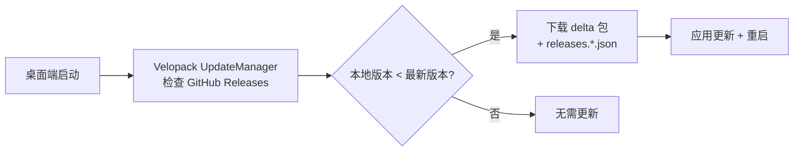
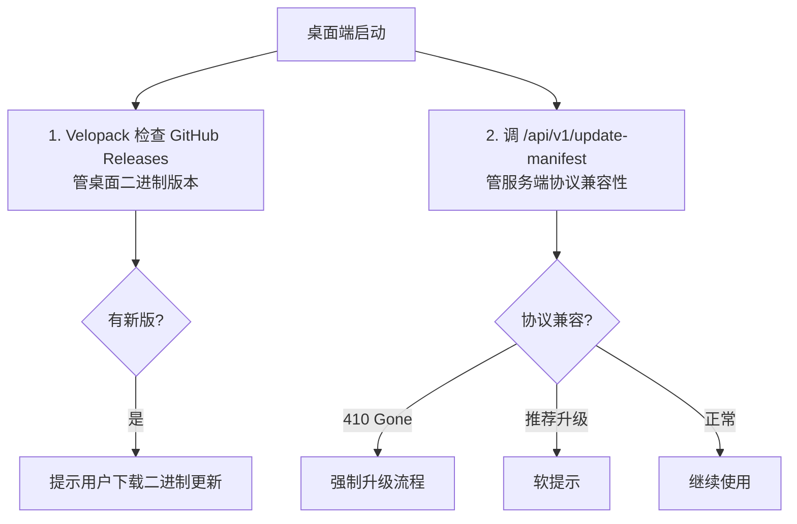

# DustNote 客户端更新通道设计

> 文档版本：v2.0.0
> 适用产品：DustNote · 尘心笔记
> 目标读者：架构师 / 客户端工程师 / 运维 / SRE
> 关联文档：[integrate-velopack.md](./integrate-velopack.md)、[standalone-mode.md](./standalone-mode.md)

---

## 0. 目标与原则

### 0.1 为什么需要专门设计

DustNote 客户端覆盖 5 个平台（Web / Desktop / Android / iOS / 小程序），涉及 E2EE 密钥迁移、SQLite 升级、服务端 API 兼容性。**没有统一的更新通道设计，会出现：**

- 用户长期不升级，服务端升级后旧客户端突然无法使用
- 安全漏洞发布后无法快速全量覆盖
- 数据迁移脚本不兼容导致笔记丢失
- 灰度发布缺乏可观测性，事故回滚慢

### 0.2 五大原则

1. **服务端权威**：所有升级决策由服务端 `update-manifest` API 驱动
2. **强制升级有度**：仅在 **安全 P0** 或 **数据兼容性破坏** 时强制；功能升级不强制
3. **向后兼容 ≥ 1 个大版本**：v1.x 服务端必须能服务 v0.x 客户端至少 90 天
4. **E2EE 迁移平滑**：密钥派生算法升级时支持双版本解密
5. **回滚 1 分钟可达**：任何通道版本 1 分钟内可降级

---

## 1. 版本策略

### 1.1 SemVer 严格

格式：`MAJOR.MINOR.PATCH`（如 `1.2.3`）

| 段    | 含义             | 触发                                  |
| ----- | ---------------- | ------------------------------------- |
| MAJOR | 不兼容变更       | API v1→v2、密钥格式破坏、密文格式破坏 |
| MINOR | 新功能、向后兼容 | 主题、模板、分享、桌面端首版          |
| PATCH | 修复、向后兼容   | bug、安全修复                         |

### 1.2 通道（Channel）

| 通道      | 默认 | 升级方式     | 适用         |
| --------- | ---- | ------------ | ------------ |
| `nightly` | ❌   | 每晚构建     | 内部开发     |
| `canary`  | ❌   | 手动邀请 1%  | 早期发现 bug |
| `beta`    | ❌   | 用户主动加入 | 公共测试者   |
| `stable`  | ✅   | 自动         | 全部用户     |

### 1.3 生命周期

```
nightly → canary ──24h──▶ beta ──72h──▶ stable
   自动       自动发布      手动确认    自动放量
   每日构建   1% 流量       50% 流量    100%
```

每阶段 24-72h **soak**（浸泡）时间，自动监测错误率与延迟，触发回滚即中止推进。

---

## 2. 版本兼容矩阵

### 2.1 服务端视角

| 客户端版本 | 服务端 1.0.x | 服务端 1.1.x | 服务端 2.0.x |
| ---------- | ------------ | ------------ | ------------ |
| 0.x        | ⚠️ 90 天 EOL | ❌ 410 Gone  | ❌ 410 Gone  |
| 1.0.x      | ✅ 正常      | ✅ 正常      | ❌ 410 Gone  |
| 1.1.x      | ✅ 正常      | ✅ 正常      | ❌ 410 Gone  |
| 2.0.x      | ❌ 410 Gone  | ❌ 410 Gone  | ✅ 正常      |

**EOL 政策**：

- 旧 MAJOR 版本服务端保留 90 天
- 旧 MAJOR 客户端不强制升级，但服务端可发"软提示"

### 2.2 API 兼容性

- API 路径永远带版本：`/api/v1/`、`/api/v2/`
- v1 服务端继续维护到 v2 GA 后 180 天
- 客户端发请求时带 `X-Client-Version` 头
- 响应头中带：
  - `X-Min-Client-Version: 1.0.0`（低于此强制升级）
  - `X-Recommended-Client-Version: 1.1.5`（软提示）
  - `X-Force-Update-Version: 1.0.5`（强制升级此版本及以上）

### 2.3 关键配置（服务端环境变量）

```env
MIN_CLIENT_VERSION=1.0.0
RECOMMENDED_CLIENT_VERSION=1.1.5
FORCE_UPDATE_VERSION=        # 空表示不强制
SERVER_VERSION=1.2.0
EOL_DATE_FOR_V0=2026-12-31
```

---

## 3. Update Manifest API

### 3.1 端点

```
GET https://api.dustnote.app/api/v1/update-manifest
```

### 3.2 请求

```http
GET /api/v1/update-manifest HTTP/1.1
Host: api.dustnote.app
X-Client-Version: 1.2.0
X-Client-Platform: web|desktop|android|ios|miniprogram
X-Client-Channel: stable|beta|canary|nightly
X-Client-Device-Id: <uuid>
```

### 3.3 响应（200 OK）

```json
{
  "serverVersion": "1.2.0",
  "channel": "stable",
  "latest": {
    "version": "1.2.3",
    "releaseDate": "2026-08-15T03:00:00Z",
    "changelogUrl": "https://dustnote.app/changelog#1.2.3",
    "mandatory": false,
    "minServerVersion": "1.0.0",
    "artifacts": {
      "web": {
        "url": "https://cdn.dustnote.app/web/v1.2.3/index.html",
        "hash": "sha256:abc123...",
        "size": 524288
      },
      "desktop": {
        "macos": {
          "url": "https://cdn.dustnote.app/desktop/v1.2.3/macos-universal.dmg",
          "hash": "sha256:def456...",
          "size": 12582912,
          "signature": "ed25519:..."
        },
        "windows": {
          "url": "https://cdn.dustnote.app/desktop/v1.2.3/windows-x64.exe",
          "hash": "sha256:ghi789...",
          "size": 14680064,
          "signature": "ed25519:..."
        },
        "linux": {
          "url": "https://cdn.dustnote.app/desktop/v1.2.3/linux-x86_64.AppImage",
          "hash": "sha256:jkl012...",
          "size": 13631488,
          "signature": "ed25519:..."
        }
      },
      "android": {
        "apk": {
          "url": "https://cdn.dustnote.app/android/v1.2.3/app.apk",
          "hash": "sha256:mno345...",
          "size": 31457280,
          "minSdkVersion": 28
        },
        "aab": {
          "playUrl": "https://play.google.com/store/apps/details?id=app.dustnote"
        }
      },
      "ios": {
        "appStoreUrl": "https://apps.apple.com/app/dustnote/id1234567890",
        "minOsVersion": "16.0"
      },
      "miniprogram": {
        "version": "1.2.3",
        "qrcodeUrl": "https://cdn.dustnote.app/miniprogram/qr.png"
      }
    }
  },
  "minClientVersion": "1.0.0",
  "recommendedClientVersion": "1.1.5",
  "forceUpdateVersion": null,
  "eolDate": "2027-06-30",
  "maintenance": null
}
```

### 3.4 响应（410 Gone — 强制升级）

```http
HTTP/1.1 410 Gone
Content-Type: application/json
X-Force-Update-Version: 1.0.5
X-Update-Url: https://dustnote.app/download

{
  "error": "client_version_eol",
  "message": "当前版本已停止支持，请升级后继续使用",
  "forceUpdateVersion": "1.0.5",
  "updateUrl": "https://dustnote.app/download"
}
```

### 3.5 维护模式（503 Service Unavailable）

```json
{
  "error": "maintenance",
  "message": "服务正在维护，预计 30 分钟内恢复",
  "estimatedResumeTime": "2026-08-15T04:00:00Z",
  "statusPage": "https://status.dustnote.app"
}
```

### 3.6 缓存策略

- `Cache-Control: public, max-age=300`（5 分钟）
- ETag 启用
- 客户端可监听 `version` 变化，CDN 层做边缘缓存

---

## 4. 强制更新策略

### 4.1 强制级别

| 级别            | 触发条件            | 用户体验                        | 时限       |
| --------------- | ------------------- | ------------------------------- | ---------- |
| **L0 阻塞**     | 安全 P0 漏洞        | 全屏黑屏，仅"立即升级"按钮      | 24h 内必须 |
| **L1 二次启动** | 服务端 EOL 客户端版 | 启动时提醒，二次启动后阻塞      | 7d 内必须  |
| **L2 强提示**   | 破坏性更新          | 启动时弹窗，每日提醒            | 14d 内必须 |
| **L3 软提示**   | 推荐升级            | 设置页红点，列表页角标          | 持续提示   |
| **L4 静默**     | Patch               | 桌面端静默下载 / 移动端下次启动 | —          |

### 4.2 强制更新判定逻辑

```typescript
function shouldForceUpdate(currentVersion, manifest): ForceLevel {
  if (semver.lt(currentVersion, manifest.forceUpdateVersion)) return 'L0';
  if (semver.lt(currentVersion, manifest.minClientVersion)) return 'L1';
  if (semver.lt(currentVersion, manifest.recommendedClientVersion) && daysSinceRelease > 14)
    return 'L2';
  return null; // 无强制
}
```

### 4.3 紧急强制（无需版本迭代）

服务端可推送 `X-Emergency-Force: 1` 响应头，客户端立即进入强制升级流程。**仅用于：**

- 客户端存在严重安全漏洞且无法远程修复
- 服务端 API 因事故必须立即废弃

---

## 5. 灰度发布流程

### 5.1 阶段定义

```mermaid
flowchart LR
    A[nightly<br/>内部] -->|自动| B[canary<br/>1%]
    B -->|24h soak + 自动检查| C[beta<br/>50%]
    C -->|72h soak + 人工确认| D[stable<br/>100%]

    B -.错误率 >0.5%.-> X[自动回滚]
    C -.错误率 >0.3%.-> X
    D -.错误率 >0.1%.-> X
    X[回滚到上一稳定版]
```

### 5.2 流量切分实现

服务端 `update-manifest` API 根据 `X-Client-Device-Id` 哈希首字节判断通道：

```typescript
function channelForDevice(deviceId, requestedChannel): string {
  if (requestedChannel === 'nightly' || requestedChannel === 'canary') {
    return requestedChannel; // 用户主动选择
  }

  if (requestedChannel === 'beta') {
    return isBetaTester(deviceId) ? 'beta' : 'stable';
  }

  // stable 通道
  const stableManifest = getManifest('stable', '1.2.3'); // 当前稳定
  const canaryManifest = getManifest('canary', '1.3.0-rc.1');
  const betaManifest = getManifest('beta', '1.3.0-beta.2');

  // 1% 灰度到 beta
  const hash = sha256(deviceId).charCodeAt(0);
  if (hash < 256 * 0.01 && betaManifest) return 'beta';

  return 'stable';
}
```

### 5.3 自动回滚条件

| 指标         | 阈值                     | 检测周期 |
| ------------ | ------------------------ | -------- |
| 5xx 错误率   | > 0.5%                   | 5 min    |
| API P95 延迟 | > 2× 基线                | 5 min    |
| 崩溃率       | > 0.1%                   | 10 min   |
| 健康检查失败 | 3 连续失败               | 1 min    |
| 启动异常     | 启动后 30s 内崩溃 > 0.5% | 实时     |

**回滚动作**：GitHub Action 调用 `kubectl rollout undo` 或 `docker compose pull <prev-tag>` + 钉钉/飞书告警。

### 5.4 人工确认

推进到 stable 通道**必须**人工确认：

```yaml
# GitHub Action 等待
needs: promote-to-stable
environment: production-stable
```

---

## 6. 各端更新机制

### 6.1 Web 端

| 机制 | 描述                                                             |
| ---- | ---------------------------------------------------------------- |
| 检测 | 启动时 + 每 1h `GET /update-manifest`                            |
| 提示 | 软提示：右下角 toast 7 天后转全屏                                |
| 强更 | 服务端 `Set-Cookie: mn_force_update=1; Max-Age=86400` → 强制刷新 |
| 回退 | Service Worker 缓存兜底                                          |

**强更实现**：

```typescript
async function checkForUpdate() {
  const m = await fetch('/api/v1/update-manifest', {
    headers: { 'X-Client-Version': pkg.version /* ... */ },
  });

  if (m.status === 410) {
    showFullScreenUpdateModal(m.body.updateUrl);
    return;
  }

  const data = await m.json();

  if (semver.lt(pkg.version, data.forceUpdateVersion)) {
    showFullScreenUpdateModal(data.latest.artifacts.web.url);
  } else if (semver.lt(pkg.version, data.latest.version)) {
    showToastWithAction('新版本可用', '立即更新', () => {
      window.location.href = data.latest.artifacts.web.url + '?t=' + Date.now();
    });
  }
}
```

### 6.2 桌面端（Tauri 2）

| 机制 | 描述                                       |
| ---- | ------------------------------------------ |
| 库   | `tauri-plugin-updater`                     |
| 签名 | `minisign` 公私钥对，私钥放 GitHub Secrets |
| 清单 | 上述 update-manifest                       |
| 强制 | 设置 `installMode: "force"`                |
| 静默 | 桌面端托盘静默下载，下次启动安装           |

**tauri.conf.json**：

```json
{
  "plugins": {
    "updater": {
      "endpoints": ["https://api.dustnote.app/api/v1/update-manifest"],
      "pubkey": "RWTd3tEXC9pD2gKJ9zJ3Kz9Kz...",
      "windows": {
        "installMode": "passive"
      }
    }
  }
}
```

### 6.3 Android 端（React Native）

| 机制      | 描述                                                     |
| --------- | -------------------------------------------------------- |
| Play 优先 | `react-native-play-install-referrer` + In-App Update API |
| 自托管    | APK 直链 + manifest 中提供                               |
| 强制      | Play 强制 update 优先级 `IMMEDIATE`                      |
| 静默      | `FLEXIBLE` + 后台下载                                    |

```typescript
import { AppUpdate } from 'react-native-play-install-referrer';

async function checkForUpdate() {
  const info = await getAppUpdateInfo();
  if (info.updateAvailability) {
    if (shouldForce(info.availableVersionCode)) {
      AppUpdate.startUpdate({ installMode: UpdateMode.IMMEDIATE });
    } else {
      AppUpdate.startUpdate({ installMode: UpdateMode.FLEXIBLE });
    }
  }
}
```

### 6.4 iOS 端（React Native）

| 机制      | 描述                                     |
| --------- | ---------------------------------------- |
| App Store | `itunes-check` 远程检测 + App Store 跳转 |
| 强制      | Apple 不允许强制；只能发文案提示用户升级 |
| 紧急      | 通过 iOS 推送 + 应用内全屏遮罩引导       |

### 6.5 微信小程序

```typescript
const updateManager = Taro.getUpdateManager();

updateManager.onCheckForUpdate((res) => {
  if (res.hasUpdate) {
    showModal('新版本', '点击确定更新', () => {
      updateManager.onUpdateReady(() => {
        Taro.applyUpdate();
      });
    });
  }
});

updateManager.onUpdateFailed(() => {
  showModal('更新失败', '请扫码重新进入', qrcodeUrl);
});
```

**强制更新**：

```typescript
// 服务端下发的 forceUpdateVersion
if (semver.lt(currentVersion, manifest.forceUpdateVersion)) {
  Taro.showModal({
    title: '必须升级',
    content: '当前版本已停止支持，请升级后继续使用',
    showCancel: false,
    confirmText: '立即升级',
  });
}
```

---

## 7. 数据迁移（Breaking Change）

### 7.1 服务端 SQLite

工具：`better-sqlite3-migrations` 或自写 `MIGRATIONS` 表

```typescript
// server/migrations/
// 001_initial.sql
// 002_add_tags.sql
// 003_add_attachments.sql
// 010_e2ee_ciphertext.sql
// 011_force_update_table.sql

export const MIGRATIONS = [
  {
    id: 1,
    name: 'initial',
    up: (db) => db.exec(fs.readFileSync('./migrations/001_initial.sql', 'utf8')),
  },
  // ...
];

export function migrate(db) {
  db.exec(`CREATE TABLE IF NOT EXISTS _migrations (id INTEGER PRIMARY KEY, applied_at TEXT)`);
  const applied = new Set(
    db
      .prepare('SELECT id FROM _migrations')
      .all()
      .map((r) => r.id)
  );
  for (const m of MIGRATIONS) {
    if (!applied.has(m.id)) {
      m.up(db);
      db.prepare('INSERT INTO _migrations VALUES (?, ?)').run(m.id, new Date().toISOString());
    }
  }
}
```

### 7.2 客户端本地数据库（SQLCipher）

同样使用迁移表，每次启动检查 `localSchemaVersion`：

```typescript
const localVersion = db.prepare('SELECT value FROM kv WHERE key = ?').get('schemaVersion')?.value;
if (localVersion < CURRENT_SCHEMA_VERSION) {
  for (let v = localVersion + 1; v <= CURRENT_SCHEMA_VERSION; v++) {
    await runMigration(v);
  }
  db.prepare('INSERT OR REPLACE INTO kv (key, value) VALUES (?, ?)').run(
    'schemaVersion',
    CURRENT_SCHEMA_VERSION
  );
}
```

### 7.3 E2EE 密钥迁移

**关键场景**：KDF（密钥派生函数）参数升级。

```
v1: Argon2id(m=64MB, t=3, p=4)  →  v2: Argon2id(m=128MB, t=4, p=4)
```

**迁移策略**：

```typescript
// 用户登录时尝试最新算法，失败回退旧算法
async function deriveMasterKey(password, salt) {
  const params = getCurrentKdfParams(); // v2
  try {
    return await argon2id(password, salt, params);
  } catch (e) {
    const oldParams = { m: 64 * 1024, t: 3, p: 4 };
    return await argon2id(password, salt, oldParams);
  }
}

// 每条笔记记录 keyVersion，访问时自动重加密
async function readNote(id) {
  const enc = db.getEncrypted(id);
  if (enc.keyVersion === CURRENT_KEY_VERSION) {
    return decrypt(enc);
  }
  // 旧版本：先解密再用新版本重加密
  const oldKey = deriveKeyWithVersion(masterKey, enc.keyVersion);
  const plaintext = decrypt(enc, oldKey);
  const newEnc = encrypt(plaintext, masterKey, CURRENT_KEY_VERSION);
  db.update(id, { ciphertext: newEnc, keyVersion: CURRENT_KEY_VERSION });
  return plaintext;
}
```

**关键原则**：

- 升级 KDF 不需要用户重置密码
- 升级过程是**惰性的**（首次访问触发）
- 升级是**原子的**（一次解密 + 重加密，失败回滚）
- 服务端**永远不知道**用户的 KDF 版本

### 7.4 服务端 API 兼容性

- 旧 v1 客户端发请求 → v1.x 服务端正常处理
- 旧 v1 客户端发请求 → v2.x 服务端返回 `410 Gone` + migration guide
- 旧 v1 服务端运行 v2 客户端 → 服务端忽略未知字段

### 7.5 API v1 → v2 切换脚本

```bash
# 1. 部署 v1.x + v2.x 双版本（共享数据库）
# 2. 切 10% 流量到 v2
# 3. 监控 72h
# 4. 切 50% 流量
# 5. 切 100% 流量
# 6. v1 保留 90 天后下线
# 7. 强制升级 v0 客户端
```

---

## 8. 回滚

### 8.1 服务端回滚

| 通道           | 回滚方式                              | 时延     |
| -------------- | ------------------------------------- | -------- |
| Docker Compose | `docker compose pull <prev> && up -d` | < 1 min  |
| K8s            | `kubectl rollout undo`                | < 30 s   |
| 数据库         | 从备份恢复 + 迁移回滚                 | 5-15 min |

**金丝雀必须可独立回滚**（不污染 stable）。

### 8.2 客户端回滚

| 端      | 回滚方式                                |
| ------- | --------------------------------------- |
| Web     | 用户 Ctrl+Shift+R + Service Worker 清理 |
| Desktop | 上一版本 .dmg 留 6 个月，下载安装       |
| Android | Play Store 退回（24h 内可回退）         |
| iOS     | App Store 不可回退，提交新版替换        |
| 小程序  | 二维码兜底                              |

**Android/iOS 不能回滚是平台限制**——所以客户端的灰度必须保守。

### 8.3 数据库迁移回滚

每个迁移必须可逆（提供 `down`），回滚脚本部署时一起发布。

```typescript
export const MIGRATIONS = [
  {
    id: 10,
    name: 'e2ee_ciphertext',
    up: (db) => {
      /* 添加 ciphertext 列 */
    },
    down: (db) => {
      /* 删除 ciphertext 列 */
    },
  },
];
```

---

## 9. 通知与发布说明

### 9.1 客户端展示

| 通道     | 时机       | 内容                               |
| -------- | ---------- | ---------------------------------- |
| 启动弹窗 | 强制更新   | 版本号 + changelog 摘要 + 升级按钮 |
| 设置页   | 有可选更新 | "新版本 1.2.3 可用" + 跳转         |
| 升级完成 | 升级后首启 | "已升级到 1.2.3" + what's new      |
| 关于页   | 任意       | 当前版本 + 服务端版本 + 检查更新   |

### 9.2 邮件

- **重大版本 / EOL 通知**：发布前 14 天邮件提醒
- **EOL 前 7 天 / 1 天**：再次邮件 + 应用内强提示
- **EOL 当天**：阻断旧版本 + 邮件说明

### 9.3 状态页

发版期间在 [status.md](./status.md) 公告：

```yaml
maintenance:
  window: '2026-08-15 03:00-04:00 UTC+8'
  impact: '客户端可能有 1-2 次重连，服务端 API 不中断'
```

---

## 10. 监控与可观测性

### 10.1 关键指标

| 指标                                                   | 来源       | 阈值       |
| ------------------------------------------------------ | ---------- | ---------- |
| `mn_update_manifest_requests_total{channel}`           | 服务端     | -          |
| `mn_update_forced_clients_total`                       | 服务端     | -          |
| `mn_update_download_started_total{platform,version}`   | CDN        | -          |
| `mn_update_download_completed_total{platform,version}` | 客户端上报 | -          |
| `mn_update_adoption_rate{version}`                     | 服务端聚合 | 7 天 ≥ 80% |
| `mn_update_check_failures_total{platform}`             | 客户端上报 | -          |
| `mn_app_crashes_total{platform,version}`               | 客户端     | < 0.1%     |

### 10.2 升级采用率仪表盘

```promql
# 7 天内升级到 latest 的客户端比例
sum(rate(mn_update_completed{version=~"1.2.*"}[7d])) /
sum(rate(mn_app_started{version!="unknown"}[7d]))
```

### 10.3 告警

| 告警             | 条件             |
| ---------------- | ---------------- |
| 升级采用率低     | 7 天 < 50%       |
| 强制更新覆盖率低 | 强制版 24h < 80% |
| 检查更新失败率高 | > 5%             |
| 新版本崩溃率高   | > 0.5%           |

---

## 11. 安全考量

### 11.1 签名

- **桌面端**：`minisign` Ed25519 签名，私钥在 GitHub Secrets + 离线备份
- **Android**：Play App Signing + APK v2/v3 签名
- **iOS**：Apple 强制签名链
- **小程序**：微信平台保证

### 11.2 清单完整性

`update-manifest` 启用 **SRI（Subresource Integrity）**：

- 每个 `downloadUrl` 配 `hash` 字段
- 客户端下载后必须校验 SHA-256

### 11.3 反劫持

- 强制 HTTPS + HSTS Preload
- CSP 中 `default-src` 限定
- 桌面端签名验证
- 失败回滚到上一稳定版本

### 11.4 隐私

- update-manifest **不携带用户信息**
- `X-Client-Device-Id` 哈希化存储 7 天
- 升级采用率仅聚合，不追踪个人

---

## 12. 风险登记

| 风险                       | 等级 | 缓解                                       |
| -------------------------- | ---- | ------------------------------------------ |
| 强制升级用户反弹           | 中   | 仅安全 EOL 场景使用；提供 CLI 跳过         |
| iOS App Store 审核拖延     | 中   | 提前 14 天提交，hotfix 走 expedited review |
| 小程序审核被驳回           | 中   | 提前学习《小程序运营规范》                 |
| KDF 升级失败导致笔记无法读 | 高   | 双版本解密 + 原写替换 + 详细日志           |
| Play Store 不可用          | 低   | APK 自托管 fallback（自签）                |
| 升级采用率过低             | 中   | 多渠道通知 + EOL 强制                      |
| 数据库迁移失败             | 高   | 事务 + 备份 + 回滚脚本 + 演练              |

---

## 13. 实施任务

| 任务                                  | 版本 | 负责        |
| ------------------------------------- | ---- | ----------- |
| 服务端 `update-manifest` API + 中间件 | M0.5 | 后端        |
| 客户端启动检测 + 软/硬提示 UI         | M0.5 | 前端 + 移动 |
| 桌面端 `tauri-plugin-updater` 集成    | M1.2 | 桌面        |
| Android In-App Update 集成            | M1.2 | 移动        |
| iOS 远程检测                          | M1.2 | 移动        |
| 小程序 `getUpdateManager`             | M1.2 | 小程序      |
| SQLite 迁移工具                       | M0.5 | 后端        |
| E2EE 双版本解密                       | M2.0 | 共享层      |
| 灰度发布脚本                          | M1.5 | 运维        |
| 自动回滚                              | M1.5 | 运维        |
| 升级采用率仪表盘                      | M1.5 | 运维        |
| 各端升级 E2E 测试                     | M1.5 | 测试        |

---

## 14. 关键文件位置

```
dustnote/
├── .github/workflows/
│   ├── ci.yml
│   └── release.yml         # 多通道产物
├── shared/
│   └── src/
│       ├── version.ts      # 统一 semver 工具
│       └── update-check.ts # 客户端更新检测
├── server/
│   ├── src/
│   │   ├── routes/
│   │   │   └── update-manifest.ts
│   │   ├── middleware/
│   │   │   └── version-check.ts  # X-Client-Version 校验
│   │   └── migrations/
│   │       ├── 001_initial.sql
│   │       └── ...
│   └── Dockerfile
├── web/src/lib/update.ts
├── desktop/src-tauri/tauri.conf.json
├── mobile/android/app/build.gradle
└── miniprogram/src/utils/update.ts
```

---

## 15. 关键决策（与 [tech-architecture.md §0](./tech-architecture.md) 一致）

| 项           | 决策                                  |
| ------------ | ------------------------------------- |
| 版本规范     | SemVer 严格                           |
| 通道         | nightly / canary / beta / stable 四级 |
| 强制升级     | 仅安全 P0 / EOL 强制                  |
| 桌面签名     | Ed25519 (minisign)                    |
| Android 签名 | Play App Signing + APK v2/v3          |
| 数据迁移     | `MIGRATIONS` 表 + 可逆脚本            |
| E2EE 迁移    | 双版本解密 + 惰性重加密               |
| 回滚         | 服务端 1 min / 客户端平台限制         |
| 兼容期       | 旧 MAJOR 服务端 90 天                 |

---

## 16. v2.0.0 Release 资产命名与分发（新增）

### 16.1 资产命名约定

v2.0.0 起，所有 GitHub Release 资产统一命名为 `DustNote-<Platform>-<Version>.<ext>`，便于用户识别与自动化脚本解析：

| 资产类型                      | 命名格式                            | 示例                                      |
| ----------------------------- | ----------------------------------- | ----------------------------------------- |
| Windows 桌面安装包            | `DustNote-Windows-<Version>.exe`    | `DustNote-Windows-2.0.0.exe`              |
| macOS 桌面安装包              | `DustNote-macOS-<Version>.dmg`      | `DustNote-macOS-2.0.0.dmg`                |
| Linux 桌面安装包              | `DustNote-Linux-<Version>.AppImage` | `DustNote-Linux-2.0.0.AppImage`           |
| Android APK                   | `DustNote-Android-<Version>.apk`    | `DustNote-Android-2.0.0.apk`              |
| 服务端部署包                  | `DustNote-Server-<Version>.zip`     | `DustNote-Server-2.0.0.zip`               |
| Web 静态资源包                | `DustNote-Web-<Version>.zip`        | `DustNote-Web-2.0.0.zip`                  |
| Velopack 内部文件（不重命名） | 保留原名                            | `releases.win.json`、`*.nupkg`、`*.delta` |

> **关键约束**：Velopack 的 `releases.*.json` + delta 包必须**保留原名**，UpdateManager 依赖这些文件名做增量更新匹配。仅重命名 `Setup.exe`（用户入口）。

### 16.2 三分区 Release Body 结构

Release body 按用途分为三个分区，便于不同用户群快速找到所需资产：

```markdown
## 📦 客户端安装包

> 普通用户下载安装包即可使用，无需部署服务端。

| 平台    | 下载                          | 说明                   |
| ------- | ----------------------------- | ---------------------- |
| Windows | DustNote-Windows-2.0.0.exe    | 双击安装，支持自动更新 |
| macOS   | DustNote-macOS-2.0.0.dmg      | Intel + Apple Silicon  |
| Linux   | DustNote-Linux-2.0.0.AppImage | 直接运行，免安装       |
| Android | DustNote-Android-2.0.0.apk    | 侧载安装               |

## 🖥️ 服务端部署

> 自托管用户使用，部署到自己的服务器后客户端选择「连接服务器」模式。

- 完整部署文档：[DEPLOY.md](https://github.com/Hermitweb/dustnote/blob/main/DEPLOY.md)
- 服务端部署包：DustNote-Server-2.0.0.zip（含源码 + Dockerfile + docker-compose.yml）
- 健康检查：`GET /api/v1/health` 返回 `{ ok, uptime, version: "2.0.0", ... }`
- 版本要求：客户端 v2.0.0 ↔ 服务端 v2.0.0（兼容矩阵见 [docs/compatibility-matrix.md](../../docs/compatibility-matrix.md)）

## 🔄 自动更新

> 已安装桌面端的用户通过 Velopack 自动检查更新，无需手动下载。

- 更新源：GitHub Releases（`https://github.com/Hermitweb/dustnote`）
- 内部文件：`releases.*.json` + `*.delta`（增量包，体积减少 70-90%）
- 桌面端检查更新入口：设置 → 关于 → 检查更新
- 联机模式额外检查 `/api/v1/update-manifest`（协议兼容性）

### v2.0.0 变更亮点

- 单机/联机双模式架构（详见 [standalone-mode.md](./standalone-mode.md)）
- masterKey 双重包装机制
- 模式切换数据迁移
- 全文档更新（PRD/roadmap/tech-architecture/security 等）
```

### 16.3 Release 工作流改造要点

`.github/workflows/release.yml` v2.0.0 改造内容：

| 改动点                                         | 说明                                                                 |
| ---------------------------------------------- | -------------------------------------------------------------------- |
| 资产重命名                                     | 各平台构建产物统一命名为 `DustNote-<Platform>-<Version>.<ext>`       |
| 三分区 body                                    | Release notes 按客户端/服务端/自动更新三区分组                       |
| 新增 build-server-zip job                      | 独立打包服务端部署 zip（含 Dockerfile + docker-compose + DEPLOY.md） |
| Velopack 内部文件保留原名                      | `releases.*.json` + delta 包不重命名，仅 Setup.exe 改名              |
| macOS/Linux 桌面构建 `continue-on-error: true` | macOS 硬件限制（vpk pack 需 macOS）                                  |
| create-release `if: always()`                  | 即使 macOS/Linux 失败也创建 Release                                  |
| iOS 构建跳过                                   | 需 macOS + Xcode + Apple 签名                                        |

### 16.4 单机模式 Velopack 更新策略

单机模式无服务器，桌面端**仅依赖 GitHub Release**：



**关键点**：

- 更新源固定为 `https://github.com/Hermitweb/dustnote`（GITHUB_REPO_URL）
- 不调用 `/api/v1/update-manifest`（无服务器）
- delta 包体积小（70-90% 缩减），下载快
- 应用后自动重启，无需 UAC 弹窗

### 16.5 联机模式双重检查策略

联机模式桌面端**同时**检查两个更新源：



**两套机制职责正交**：

| 机制               | 管什么               | 数据源          | 触发场景   |
| ------------------ | -------------------- | --------------- | ---------- |
| Velopack           | 桌面二进制是否有新版 | GitHub Releases | 任意模式   |
| `/update-manifest` | 服务端协议是否兼容   | DustNote 服务器 | 仅联机模式 |

### 16.6 服务端部署包内容（DustNote-Server-2.0.0.zip）

```
DustNote-Server-2.0.0/
├── server/                       # 服务端源码
│   ├── src/
│   ├── dist/                     # 已构建产物
│   ├── package.json
│   └── Dockerfile
├── docker-compose.yml            # 一键部署
├── .env.example                  # 环境变量模板
├── DEPLOY.md                     # 完整部署文档
├── docs/
│   └── self-hosting.md
└── README.md                     # 快速开始
```

部署方式见 [DEPLOY.md](../../DEPLOY.md)：

- Docker Compose：`docker compose up -d --build`
- 手动部署：`pnpm build:server && node dist/index.js`
- 反向代理：Nginx / Caddy（含 HTTPS 自动签发）

### 16.7 版本兼容矩阵（v2.0.0）

| 客户端版本 | 服务端 1.x  | 服务端 2.0.x |
| ---------- | ----------- | ------------ |
| 1.x        | ✅ 正常     | ❌ 410 Gone  |
| 2.0.x      | ❌ 410 Gone | ✅ 正常      |

详细兼容矩阵见 [docs/compatibility-matrix.md](../../docs/compatibility-matrix.md)。

> **EOL 政策**：旧 MAJOR 版本服务端保留 90 天；旧 MAJOR 客户端不强制升级，但服务端可发"软提示"。
